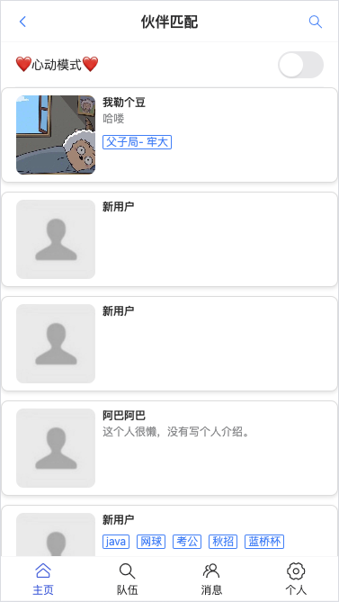
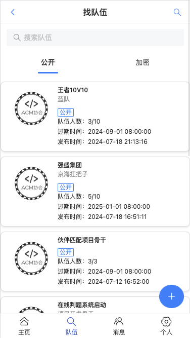
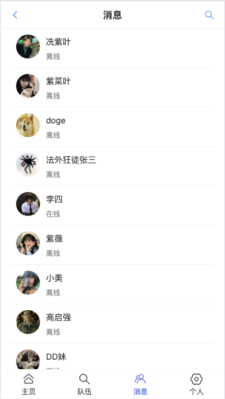
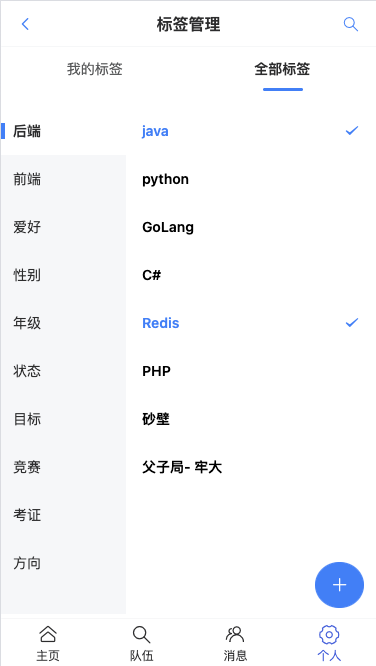
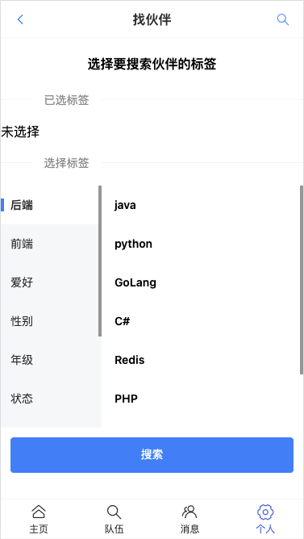
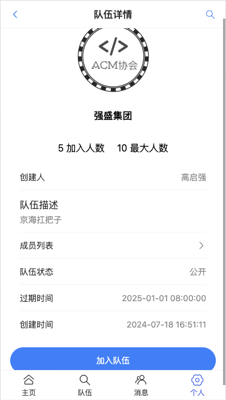
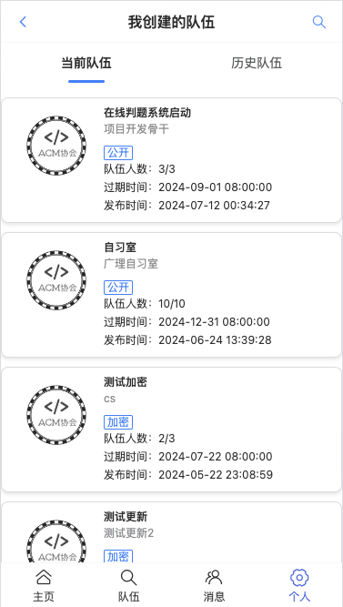
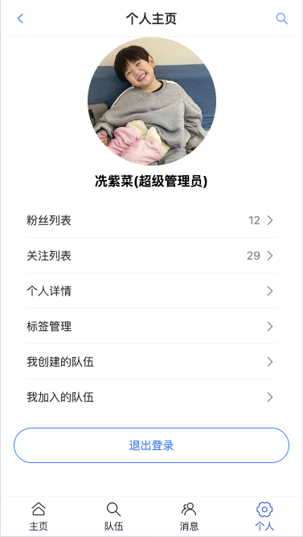
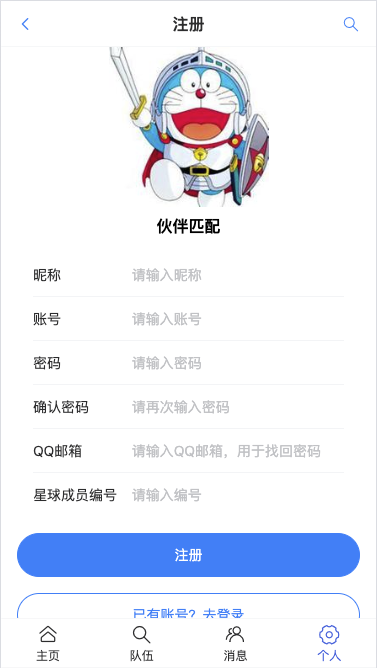
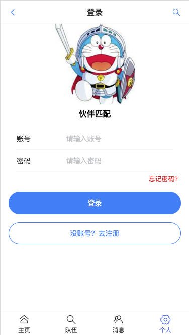

# 伙伴匹配系统

| Author | zicai |
| :----: | :---: |

域名：http://www.zicai.site

后端 Swagger 接口文档地址：http://localhost:9090/api/doc.html

> 注意：需要自定义的环境我都做了 todo 标记，运行项目之前先将配置项修改为自己的
>

## 简述

​	本项目名为伙伴匹配系统，一个移动端 H5 网页，实现了以下功能，用于帮助用户匹配与自己相似的用户，一起学习、竞赛，共同进步。

- 用户可以设置自己账号的标签，可以根据自己的标签匹配与自己最相似的用户、根据标签搜索用户，找到志同道合的伙伴。
- 用户能够组队，创建自己的队伍、查找队伍，找到一起参加竞赛的伙伴，告别孤军奋战。
- 用户还可以关注其他用户，与其他用户用户私聊。


## 效果展示

























## 技术选型

​	前后端分离架构

开发平台：WebStorm 2023 + IntelliJ IDEA 2023 + Navicat Premium16

**前端**

- JavaScript 脚本语言
- Vue3 前端框架
- VantUI 移动端 H5 组件库
- Vite 2 打包工具
- Nginx部署

**后端**

- Java 语言
- Spring 框架
- SpringMVC 表现层框架
- MyBatis 持久层框架
- MyBatis-Plus 持久层框架
- WebSocket 通信协议
- SpringBoot 框架整合第三方技术简化开发
- MySQL 数据库
- Redis 数据库

**部署**

- Ubuntu18 腾讯云 2核4G 服务器
- MySQL 8.0 腾讯云 1核1G 数据库
- Redis 5.0 腾讯云 256M 数据库


## 数据库表设计

​	用于存储用户数据

### 1. 用户表 `user`

**字段**

1. id 主键
2. username 用户昵称
3. userAccount 账号
4. avatarUrl 用户头像url地址
5. gender 性别 0-男 1-女
6. userPassword 密码
7. phone 电话
8. email 邮箱
9. userStatus 状态 0-正常
10. createTime 创建时间
11. updateTime 修改时间
12. isDelete 逻辑删除 1-已删除
13. userRole 用户角色
14. planetCode 星球编号
15. tags 用户标签
16. profile 个人简介


**建表语句**

```sql
create table user
(
    username     varchar(256)                       null comment '用户昵称',
    id           bigint auto_increment comment 'id'
        primary key,
    userAccount  varchar(256)                       null comment '账号',
    avatarUrl    varchar(1024)                      null comment '用户头像',
    gender       tinyint                            null comment '性别',
    userPassword varchar(512)                       not null comment '密码',
    phone        varchar(128)                       null comment '电话',
    email        varchar(512)                       null comment '邮箱',
    userStatus   int      default 0                 not null comment '状态 0 - 正常',
    createTime   datetime default CURRENT_TIMESTAMP null comment '创建时间',
    updateTime   datetime default CURRENT_TIMESTAMP null on update CURRENT_TIMESTAMP,
    isDelete     tinyint  default 0                 not null comment '是否删除',
    userRole     int      default 0                 not null comment '用户角色 0 - 普通用户 1 - 管理员',
    planetCode   varchar(512)                       not null comment '星球编号',
    tags         varchar(1024)                      null comment '标签 json 列表',
    profile      varchar(512)                       null comment '个人简介'
)
    comment '用户';
```


### 2. 标签表 `tag`

​	用于存储标签数据

**字段**

1. id 主键
2. tagName 标签名称
3. userId 创建的用户id 逻辑外键
4. parentId 父标签id
5. isParent 是否为父标签
6. createTime 创建时间
7. updateTime 更新时间
8. isDelete 逻辑删除 1-已删除


**建表语句**

```sql
create table user_tag
(
    id         bigint auto_increment comment 'id'
        primary key,
    tagName    varchar(256)                       null comment '标签名称',
    userId     bigint                             null comment '用户 id',
    parentId   bigint                             null comment '父标签 id',
    isParent   tinyint                            null comment '0 -不是，1 -父标签',
    createTime datetime default CURRENT_TIMESTAMP null comment '创建时间',
    updateTime datetime default CURRENT_TIMESTAMP null on update CURRENT_TIMESTAMP comment '更新时间',
    isDelete   tinyint  default 0                 not null comment '是否删除'
)
    comment '标签';
```


### 3. 队伍表 `team`

​	用于存储队伍信息

**字段**

1. id 主键
2. name 队伍名称
3. description 队伍描述
4. expireTime 超时时间
5. userId 创建者（队长）id 逻辑外键
6. status 状态 0-公开，1-私有，2-加密
7. password 私有队伍密码
8. createTime 创建时间
9. updateTIme 更新时间
10. isDelete 逻辑删除 1-已删除


**建表语句**

```sql
create table user_team
(
    id         bigint auto_increment comment 'id'
        primary key,
    userId     bigint                             null comment '用户id',
    teamId     bigint                             null comment '队伍id',
    joinTime   datetime                           null comment '加入时间',
    createTime datetime default CURRENT_TIMESTAMP null comment '创建时间',
    updateTime datetime default CURRENT_TIMESTAMP null on update CURRENT_TIMESTAMP,
    isDelete   tinyint  default 0                 not null comment '是否删除'
)
    comment '用户队伍关系';
```


### 4. 用户队伍关系表 `user_team`

​	用于存放队伍对应的成员信息

**字段**

1. id 主键
2. userId 用户id 逻辑外键
3. teamId 队伍id 逻辑外键
4. joinTIme 加入时间
5. createTime 创建时间
6. updateTime 更新时间
7. isDelete 逻辑删除 1-已删除


**建表语句**

```sql
create table user_team
(
    id         bigint auto_increment comment 'id'
        primary key,
    userId     bigint                             null comment '用户id',
    teamId     bigint                             null comment '队伍id',
    joinTime   datetime                           null comment '加入时间',
    createTime datetime default CURRENT_TIMESTAMP null comment '创建时间',
    updateTime datetime default CURRENT_TIMESTAMP null on update CURRENT_TIMESTAMP,
    isDelete   tinyint  default 0                 not null comment '是否删除'
)
    comment '用户队伍关系';
```


### 5. 粉丝关注表 `follow_relationship`

​	存储用户关注的用户以及粉丝

**字段**

1. id 主键
2. follower_id 关注者id 逻辑外键
3. followed_id 被关注者id 逻辑外键
4. create_time 创建时间
5. is_delete 逻辑删除 1-已删除


**建表语句**

```sql
create table follow_relationship
(
    id          bigint auto_increment
        primary key,
    follower_id bigint                             not null comment '关注者ID',
    followed_id bigint                             not null comment '被关注者ID',
    create_time datetime default CURRENT_TIMESTAMP null comment '关注时间',
    is_delete   tinyint  default 0                 null comment '是否删除'
)
    comment '粉丝关注关系';
```


### 6. 私聊信息表 `chat_messages`

​	存储用户私聊消息数据

**字段**

1. chat_id 主键
2. sender_id 发送者id 逻辑外键
3. receiver_id 接收者id 逻辑外键
4. timestamp 发送时间
5. read_status 已读状态 0-未读，1-已读


**建表语句**

```sql
create table chat_messages
(
    chat_id     int auto_increment comment '唯一标识'
        primary key,
    sender_id   int                                  null comment '发送者id',
    receiver_id int                                  null comment '接收者id',
    message     text                                 null comment '消息内容',
    timestamp   timestamp  default CURRENT_TIMESTAMP not null comment '发送时间',
    read_status tinyint(1) default 0                 null comment '状态：0-未读，1-已读'
)
    comment '用户私聊消息表';
```


### 7. 用户在线状态表 `user_online_status`

​	存储用户在线信息

**字段**

1. user_id 用户id 主键 逻辑外键
2. is_online 状态 0-离线，1-在线
3. last_online 最后在线时间


**建表语句**

```sql
create table user_online_status
(
    user_id     bigint                               not null comment '用户id'
        primary key,
    is_online   tinyint(1) default 0                 null comment '状态，0-离线，1-在线',
    last_online timestamp  default CURRENT_TIMESTAMP not null on update CURRENT_TIMESTAMP comment '最后在线时间'
)
    comment '用户在线状态表';
```


## 配置

### 登录态存储

​	登录态 Session 共享，当项目多机部署时，将用户登录态保存在 Redis 数据库中，实现共享登录态

选择 Redis 存储 Session 的原因：基于内存的 K / V 数据库，用户信息读取 / 是否登录的判断极其**频繁** ，Redis 基于内存，读写性能很高。

1. 引入 redis，能够操作 redis：

   ```xml
   <!-- https://mvnrepository.com/artifact/org.springframework.boot/spring-boot-starter-data-redis -->
   <dependency>
       <groupId>org.springframework.boot</groupId>
       <artifactId>spring-boot-starter-data-redis</artifactId>
       <version>2.6.4</version>
   </dependency>
   ```

2. 引入 spring-session 和 redis 的整合，使得自动将 session 存储到 redis 中：

   ```xml
   <!-- https://mvnrepository.com/artifact/org.springframework.session/spring-session-data-redis -->
   <dependency>
       <groupId>org.springframework.session</groupId>
       <artifactId>spring-session-data-redis</artifactId>
       <version>2.6.3</version>
   </dependency>
   ```

3. 修改 spring-session 存储配置 `spring.session.store-type`

   - 默认是 none，表示存储在单台服务器

   - store-type: redis，表示从 redis 读写 session

   - ```yaml
     spring:
       # 外网连接腾讯云 redis 配置
       redis:
         port: your_port
         host: your_host
         database: 1 # 登录态存储在1号数据库
         password: your_password
       # session
       session:
         # 失效时间(min)
         timeout: 10080
         # 在 redis 读写 session
         store-type: redis
     ```

**Cookie 共享**

​	将 Cookie 存储在公共域名 `zicai.site` ，可以与子域名共享 Cookie 

### 配置跨域

​	**跨域**指的是在一个域（origin）上的网页或脚本，尝试请求另一个域上的资源。一个域由协议（http/https）、主机名（domain）和端口号（port）三部分组成，如果两个URL的协议、主机名和端口三者之一不同，它们就被认为是不同的域，以下是部分例子：

- `http://example.com` 和 `http://example.org`：主机名不同
- `http://example.com` 和 `https://example.com`：协议不同
- `http://example.com:80` 和 `http://example.com:8080`：端口不同

​	配置跨域（Cross-Origin Resource Sharing, CORS）是为了允许或限制从不同源（不同的域、协议或端口）进行资源访问。现代浏览器使用同源策略（Same-Origin Policy）来限制从一个源加载的脚本如何与从另一个源加载的资源进行交互。虽然这种策略有助于防止某些类型的攻击（例如跨站脚本攻击），但在一些情况下，例如前后端分离的应用中，允许跨域访问是必要的。

**前后端分离架构**

​	在现代Web应用中，前端和后端通常是分离的，前端可能在一个域（如 `http://localhost:3000`）运行，而后端API服务器在另一个域（如 `http://localhost:8080`）运行。为了让前端能够访问后端API，需要配置CORS。

​	配置跨域可以在前端或者后端工程配置，本项目配置的是后端。

全局配置CORS

```java
@Configuration
public class WebConfig implements WebMvcConfigurer {

    /**
     * 跨域配置
     * @param registry
     */
    @Override
    public void addCorsMappings(CorsRegistry registry) {
        registry.addMapping("/**")
                .allowedOrigins("http://localhost:3000", "http://localhost:8000")
                .allowedMethods("GET", "POST", "PUT", "DELETE", "OPTIONS") // 允许的请求方法
                .maxAge(3600) // 预检请求的有效期
                .allowCredentials(true); // 允许携带凭证
    }
}
```

> 当然，我上面的配置是全局配置CORS。控制器级别配置CORS在控制器中使用`@CrossOrigin`注解来配置CORS。
>
> 在控制器类上或者方法中使用@CrossOrigin(origins = "http://localhost:3000")

### 整合 Swagger + Knife4j 文档

什么是接口文档？写接口信息的文档，每条接口包括：

- 请求参数
- 响应参数
- 接口地址
- 接口名称
- 请求类型
- 请求格式
- 备注

一般是后端或者负责人来提供，后端和前端都要使用

为什么需要接口文档？

- 有个书面内容（背书或者归档），便于大家参考和查阅，便于 **沉淀和维护** ，拒绝口口相传
- 接口文档便于前端和后端开发对接，前后端联调的 **介质** 。后端 => 接口文档 <= 前端
- 好的接口文档支持在线调试、在线测试，可以作为工具提高我们的开发测试效率

怎么做接口文档？

- 手写（比如腾讯文档、Markdown 笔记）
- 自动化接口文档生成：自动根据项目代码生成完整的文档或在线调试的网页。Swagger，Postman（侧重接口管理）（国外）；apifox、apipost、eolink（国产）

Swagger 使用：

1. 引入依赖（Swagger 或 Knife4j：https://doc.xiaominfo.com/knife4j/documentation/get_start.html）

   - ```xml
     <dependency>
         <groupId>com.github.xiaoymin</groupId>
         <artifactId>knife4j-openapi3-jakarta-spring-boot-starter</artifactId>
         <version>4.4.0</version>
     </dependency>
     ```

2. 自定义 Swagger 配置类

   - ```java
     import org.springframework.context.annotation.Bean;
     import org.springframework.context.annotation.Configuration;
     import org.springframework.context.annotation.Profile;
     import springfox.documentation.builders.ApiInfoBuilder;
     import springfox.documentation.builders.PathSelectors;
     import springfox.documentation.builders.RequestHandlerSelectors;
     import springfox.documentation.service.ApiInfo;
     import springfox.documentation.service.Contact;
     import springfox.documentation.spi.DocumentationType;
     import springfox.documentation.spring.web.plugins.Docket;
     import springfox.documentation.swagger2.annotations.EnableSwagger2;
     import springfox.documentation.swagger2.annotations.EnableSwagger2WebMvc;
     
     /**
      * 自定义 swagger 接口文档的配置
      *
      * @author zicai
      */
     @Configuration
     @EnableSwagger2WebMvc // Swagger的开关，表示已经启用Swagger
     @Profile({"dev", "test"}) // 指定什么环境下接口文档生效，避免泄漏信息
     public class SwaggerConfig {
         @Bean(value = "defalutApi2")
         public Docket api() {
             Docket docket = new Docket(DocumentationType.SWAGGER_2)
                     .apiInfo(apiInfo())
                     .select() // 选择哪些路径和api会生成document
                     .apis(RequestHandlerSelectors.basePackage("com.ziye.yupao.controller")) // 选择监控的package
                     .paths(PathSelectors.any()) // 对所有路径进行监控
                     .build();
             return docket;
         }
     
         /**
          * api 信息
          *
          * @return
          */
         private ApiInfo apiInfo() {
             return new ApiInfoBuilder()
                     .title("紫菜伙伴匹配")
                     .contact(new Contact("zicai", "", ""))
                     .description("接口文档")
                     .termsOfServiceUrl("")
                     .version("1.0")
                     .build();
         }
     }
     ```

3. 定义需要生成接口文档的代码位置（Controller）

4. 通过在 SwaggerConfig 配置文件开头加上 `@Profile({"dev", "test"})` 限定配置仅在开发和测试环境开启，避免线上环境暴露出去

5. 可以通过在 controller 方法上添加 @Api、@ApiImplicitParam(name = "name",value = "姓名",required = true)    @ApiOperation(value = "向客人问好") 等注解来自定义生成的接口描述信息

如果 springboot version >= 2.6，需要添加如下配置：

```yaml
spring:
  mvc:
  	pathmatch:
      matching-strategy: ANT_PATH_MATCHER
```


### 全局异常处理

1. 自定义业务异常

```java
public class BussinessException extends RuntimeException {
    private final int code;
    private final String description;

    public BussinessException(String message, int code, String description) {
        super(message);
        this.code = code;
        this.description = description;
    }

    public BussinessException(ErrorCode errorCode) {
        super(errorCode.getMessage());
        this.code = errorCode.getCode();
        this.description = errorCode.getDescription();
    }

    public BussinessException(ErrorCode errorCode, String description) {
        super(errorCode.getMessage());
        this.code = errorCode.getCode();
        this.description = description;
    }

    public int getCode() {
        return code;
    }

    public String getDescription() {
        return description;
    }
}
```

2. 定义枚举类错误码

```java
public enum ErrorCode {

    SUCCESS(0, "success", ""),
    PARAMS_ERROR(40000, "请求参数错误", ""),
    NULL_ERROR(40001, "请求数据为空", ""),
    NOT_LOGIN(40100, "未登录", ""),
    NO_AUTH(40101, "无权限", ""),
    FORBIDDEN(40301, "禁止操作", ""),
    SYSTEM_ERROR(50000, "系统错误", "");

    /**
     * 状态码
     */
    private final int code;

    /**
     * 状态码信息
     */
    private final String message;

    /**
     * 状态码描述
     */
    private final String description;

    ErrorCode(int code, String message, String description) {
        this.code = code;
        this.message = message;
        this.description = description;
    }

    public int getCode() {
        return code;
    }

    public String getMessage() {
        return message;
    }

    public String getDescription() {
        return description;
    }
}
```

3. 全局异常捕获处理

```java
@RestControllerAdvice
@Slf4j
public class GlobalExceptionHandler {

    /**
     * 处理业务异常
     * @param e
     * @return
     */
    @ExceptionHandler(BussinessException.class)
    public BaseResponse businessExceotionHandler(BussinessException e) {
        log.error("businessException:" + e.getMessage(), e);
        return ResultUtils.error(e.getCode(), e.getMessage(), e.getDescription());
    }

    /**
     * 处理其它异常
     * @param e
     * @return
     */
    @ExceptionHandler(RuntimeException.class)
    public BaseResponse runtimeExceptionHandler(RuntimeException e) {
        log.error("runtimeException:" + e.getMessage(), e);
        return ResultUtils.error(ErrorCode.SYSTEM_ERROR, "系统错误", "未知错误");
    }

}
```

​	这时，抛出的业务类型异常就能够捕获到并且封装为统一返回对象返回给前端了，避免了直接暴露异常信息。

4. 使用

```java
throw new BussinessException(ErrorCode.NOT_LOGIN, "描述信息");
```

### 分布式锁

**锁**

有限资源的情况下，控制同一时间（段）只有某些线程（用户 / 服务器）能访问到资源。

Java 实现锁：synchronized 关键字、并发包的类。

问题：只对单个 JVM 有效。

**分布式锁**

为啥需要分布式锁？

1. 有限资源的情况下，控制同一时间（段）只有某些线程（用户 / 服务器）能访问到资源。
2. 单个锁只对单个 JVM 有效。

**抢锁机制**

保证同一时间只有 1 个服务器能抢到锁？**思想** ：先来的人先把数据改成自己的标识（服务器 ip），后来的人发现标识已存在，就抢锁失败，继续等待。

等先来的人执行方法结束，把标识清空，其他的人继续抢锁。

Redis 实现：内存数据库，**读写速度快** ，方便实现分布式锁。

**注意**

1. 用完锁要释放

2. **锁一定要加过期时间**

3. 如果方法执行时间过长，锁提前过期了？

   问题：

   1. 连锁效应：释放掉别人的锁
   2. 这样还是会存在多个方法同时执行的情况

​	解决方案：续期

```java
boolean end = false;

new Thread(() -> {
    if (!end)}{
    // 续期
})

end = true;
```

4. 释放锁的时候，有可能先判断出是自己的锁，但这时锁过期了，最后还是释放了别人的锁

   ```java
   // 原子操作（运行代码时不允许其他的插入操作）
   if(get lock == A) {
       // set lock B （走到这里通过了判断后key过期自动删除了，另外一个线程恰好设置了key，此时就会删掉其他线程的key）
       del lock
   }
   ```

   Redis + lua 脚本实现

5. Redis 如果是集群（而不是只有一个 Redis），如果分布式锁的数据不同步怎么办？

https://blog.csdn.net/feiying0canglang/article/details/113258494

**Redisson 实现分布式锁**

Java 客户端，数据网格

实现了很多 Java 里支持的接口和数据结构

Redisson 是一个 java 操作 Redis 的客户端，**提供了大量的分布式数据集来简化对 Redis 的操作和使用，可以让开发者像使用本地集合一样使用 Redis，完全感知不到 Redis 的存在。**

**2 种引入方式**

1. spring boot starter 引入（不推荐，版本迭代太快，容易冲突）https://github.com/redisson/redisson/tree/master/redisson-spring-boot-starter
2. 直接引入：https://github.com/redisson/redisson#quick-start

**示例代码**

```java
// list，数据存在本地 JVM 内存中
List<String> list = new ArrayList<>();
list.add("yupi");
System.out.println("list:" + list.get(0));

list.remove(0);

// 数据存在 redis 的内存中
RList<String> rList = redissonClient.getList("test-list");
rList.add("yupi");
System.out.println("rlist:" + rList.get(0));
rList.remove(0);
```

**定时任务  + 锁**

1. waitTime 设置为 0，只抢一次，抢不到就放弃
2. 注意释放锁要写在 finally 中

**实现代码**

```java
void testWatchDog() {
    RLock lock = redissonClient.getLock("yupao:precachejob:docache:lock");
    try {
        // 只有一个线程能获取到锁
        if (lock.tryLock(0, -1, TimeUnit.MILLISECONDS)) {
            // todo 实际要执行的方法
            doSomeThings();
            System.out.println("getLock: " + Thread.currentThread().getId());
        }
    } catch (InterruptedException e) {
        System.out.println(e.getMessage());
    } finally {
        // 只能释放自己的锁
        if (lock.isHeldByCurrentThread()) { // 判断当前这个锁是不是这个线程的
            System.out.println("unLock: " + Thread.currentThread().getId());
            lock.unlock();
        }
    }
}
```

**看门狗机制**

> redisson 中提供的续期机制

开一个监听线程，如果方法还没执行完，就帮你重置 redis 锁的过期时间。

原理：

1. 监听当前线程，默认过期时间是 30 秒，每 10 秒续期一次（补到 30 秒）
2. 如果线程挂掉（注意 debug 模式也会被它当成服务器宕机），则不会续期

https://blog.csdn.net/qq_26222859/article/details/79645203

### AOP 切面更新用户数据

> ​		Spring AOP（面向切面编程）是 Spring 框架中的一个重要模块，它允许通过切面（Aspect）在应用程序的各个部分（切点，Join Point）添加额外的行为。这种编程范式可以帮助你在不改变业务逻辑代码的情况下实现诸如日志记录、性能监控、事务管理、安全检查等功能。

​		需求：为保证用户修改个人信息后的数据同步更新，本项目使用了 Spring AOP 切面编程思想来实现。当用户登录、修改个人信息后，切面类更新登录态，获取数据库中的最新数据，更新到登录态。

#### AOP 核心概念

1. **切面（Aspect）**：
   - 切面是一个模块化的关注点，例如日志记录、安全性或事务管理。切面使用普通的类来实现。
2. **连接点（Join Point）**：
   - 连接点是在程序执行过程中某个特定的点，例如方法调用或异常抛出。Spring AOP 支持方法级别的连接点。
3. **通知（Advice）**：
   - 通知定义了切面在特定的连接点采取的操作。Spring 提供了多种通知类型，例如前置通知（Before）、后置通知（After）、环绕通知（Around）、异常通知（AfterThrowing）和最终通知（AfterReturning）。
4. **切点（Pointcut）**：
   - 切点是一个集合，它定义了在哪些连接点应用通知。切点表达式使用 AspectJ 语言来定义。
5. **引入（Introduction）**：
   - 引入允许你为现有类添加新的方法或属性。Spring AOP 使用引入来支持“多继承”。
6. **目标对象（Target Object）**：
   - 目标对象是被一个或多个切面代理的对象。也叫做被通知（Advised Object）。
7. **代理（Proxy）**：
   - 代理是 AOP 框架创建的对象，用来实现切面契约。Spring AOP 使用 JDK 动态代理或 CGLIB 代理。
8. **织入（Weaving）**：
   - 织入是将切面应用到目标对象并创建新的代理对象的过程。织入可以在编译时、类加载时或运行时进行。

整合使用步骤：

**步骤 1：添加依赖** 引入 SpringAOP 依赖

```java
<dependency>
    <groupId>org.springframework.boot</groupId>
    <artifactId>spring-boot-starter-aop</artifactId>
</dependency>
```

**步骤 2：定义切面**

创建一个切面类，使用 `@Aspect` 注解和各种通知类型注解：

```java
@Aspect
@Component
public class UpdateLoginUserAspect {

    public static HttpServletRequest request = null;

    @Resource
    private UserService userService;

    /**
     * 更新用户登录态
     */
    @After("userControllerMethods()")
    public void updateLoginUser(JoinPoint joinPoint) {
        request = (HttpServletRequest) joinPoint.getArgs()[1];
        User loginUser = (User) request.getSession().getAttribute(UserConstant.USER_LOGIN_STATE);
        if (loginUser != null) {
            long loginUserId = loginUser.getId();
            User user = userService.getById(loginUserId); // 同步数据，获取数据库中的数据
            User safetyUser = userService.getSafetyUser(user); // 数据脱敏
            // 更新session中的用户数据
            request.getSession().setAttribute(UserConstant.USER_LOGIN_STATE, safetyUser);
        }
    }

    /**
     * 切入点表达式方法
     * 拦截所有修改用户数据的方法
     */
    @Pointcut("execution(* com.ziye.yupao.controller.UserController.userLogin(..))" +
            " || execution(* com.ziye.yupao.controller.UserController.updateUser(..))" +
            " || execution(* com.ziye.yupao.controller.UserController.upload(..))" +
            " || execution(* com.ziye.yupao.controller.UserController.updateTags(..))")
    public void userControllerMethods() {}

}
```

​		通过切入点表达式匹配了用户控制器类的 `userLogin`, `updateUser`, `upload`, `updateTags` 方法，后置通知注解 `@After` 控制当执行完控制器类的方法就会调用切面类的updateLoginUser 方法，更新用户登录态。

### 邮件服务

SpringBoot 整合第三方技术第三部分我们来说说邮件系统，发邮件是 Java 程序的基本操作，SpringBoot 整合 JavaMail 其实就是简化开发。不熟悉邮件的小伙伴可以先学习完 JavaMail 的基础操作，再来看这一部分内容才能感触到 SpringBoot 整合 JavaMail 究竟简化了哪些操作。简化的多码？其实不多，差别不大，只是还个格式而已。

​		学习邮件发送之前先了解3个概念，这些概念规范了邮件操作过程中的标准。

- SMTP（Simple Mail Transfer Protocol）：简单邮件传输协议，用于**发送**电子邮件的传输协议
- POP3（Post Office Protocol - Version 3）：用于**接收**电子邮件的标准协议
- IMAP（Internet Mail Access Protocol）：互联网消息协议，是POP3的替代协议

​		SMPT 是发邮件的标准，POP3是收邮件的标准，IMAP是对POP3的升级。我们制作程序中操作邮件，通常是发邮件，所以SMTP是使用的重点，收邮件大部分都是通过邮件客户端完成，所以开发收邮件的代码极少。除非要读取邮件内容，然后解析，做邮件功能的统一处理。下面是 SpringBoot 整合 JavaMail 发送邮件。

**步骤①**：导入 SpringBoot 整合 JavaMail 的 starter

```xml
<dependency>
    <groupId>org.springframework.boot</groupId>
    <artifactId>spring-boot-starter-mail</artifactId>
</dependency>
```

**步骤②**：配置邮箱的登录信息

```yaml
spring:
  mail:
    host: smtp.qq.com
    username: your_usernam@qq.com
    password: yourpassword
```

Java 程序仅用于发送邮件，邮件的功能还是邮件供应商提供的，所以这里是用别人的邮件服务，要配置对应信息。

​		host 配置的是提供邮件服务的主机协议，当前程序仅用于发送邮件，因此配置的是 smtp 的协议。

​		password 并不是邮箱账号的登录密码，是邮件供应商提供的一个加密后的密码，也是为了保障系统安全性。可以到邮件供应商的设置页面找POP3或IMAP这些关键词找到对应的获取位置。

**步骤③**：使用 JavaMailSender 接口发送邮件

```java
@Service
public class SendMailServiceImpl implements SendMailService {

    @Autowired
    private JavaMailSender javaMailSender;

    /**
     * 标题
     */
    public static final String subject = "伙伴匹配";

    /**
     * 发件人
     */
    public static final String from = "your_username@qq.com";

    /**
     * 重置密码
     * @param to 收件人邮箱
     * @param defaultPassword 随机密码
     */
    public void sendMail(String to, String defaultPassword) {
        String context = "伙伴匹配系统重置密码，已将你的密码重置为：" + defaultPassword;
        try {
            MimeMessage message = javaMailSender.createMimeMessage();
            MimeMessageHelper helper = new MimeMessageHelper(message);
            helper.setSubject(subject);
            helper.setFrom(from);
            helper.setTo(to);
            helper.setText(context);
            javaMailSender.send(message);
        } catch (Exception e) {
            throw new BussinessException(ErrorCode.SYSTEM_ERROR, "发送邮件失败");
        }
    }

}
```

​		将发送邮件的必要信息（发件人、收件人、标题、正文）封装到 SimpleMailMessage 对象中，可以根据规则设置发送人昵称等。

### 阿里云OSS对象存储服务

阿里云的对象存储服务（OSS）在存储用户头像方面具有多个优势：

1. **可靠性和持久性**：阿里云OSS 提供了高可靠性和持久性的数据存储，具备99.999999999%（11个9）的数据可靠性。
2. **安全性**：提供多层次的数据安全保障，包括数据加密、访问控制、安全审计等功能，确保用户数据的安全性。
3. **扩展性**：可以根据需要动态扩展存储空间和吞吐量，适应不同规模的用户头像存储需求。
4. **性能**：支持高并发访问和低延迟的数据读取和写入操作，能够快速响应用户的访问请求。
5. **成本效益**：提供灵活的计费方式，根据实际使用量付费，节约存储成本。
6. **可用性和全球部署**：OSS具有全球部署能力，用户可以选择就近的数据中心进行存储，提高访问速度和可用性。

使用：

1. 首先引入依赖

```xml
<dependency>
    <groupId>com.aliyun.oss</groupId>
    <artifactId>aliyun-sdk-oss</artifactId>
    <version>3.15.1</version>
</dependency>
```

2. 创建配置类，用于创建 AliOssUtil 对象

```java
@Configuration
@Slf4j
public class OssConfiguration {

    @Bean
    @ConditionalOnMissingBean// 保证整个Spring容器只有一个util对象，没有这种Bean的时候才创建
    public AliOssUtil aliOssUtil(AliOssProperties aliOssProperties) {
        log.info("开始创建阿里云文件上传工具类对象：{}", aliOssProperties);
        return new AliOssUtil(aliOssProperties.getEndpoint(),
                aliOssProperties.getAccessKeyId(),
                aliOssProperties.getAccessKeySecret(),
                aliOssProperties.getBucketName());
    }
}
```

3. 文件上传工具类

```java
@Data
@AllArgsConstructor
@Slf4j
public class AliOssUtil {

    private String endpoint;
    private String accessKeyId;
    private String accessKeySecret;
    private String bucketName;

    /**
     * 文件上传
     *
     * @param bytes
     * @param objectName
     * @return
     */
    public String upload(byte[] bytes, String objectName) {

        // 创建OSSClient实例。
        OSS ossClient = new OSSClientBuilder().build(endpoint, accessKeyId, accessKeySecret);

        try {
            // 创建PutObject请求。
            ossClient.putObject(bucketName, objectName, new ByteArrayInputStream(bytes));
        } catch (OSSException oe) {
            System.out.println("Caught an OSSException, which means your request made it to OSS, "
                    + "but was rejected with an error response for some reason.");
            System.out.println("Error Message:" + oe.getErrorMessage());
            System.out.println("Error Code:" + oe.getErrorCode());
            System.out.println("Request ID:" + oe.getRequestId());
            System.out.println("Host ID:" + oe.getHostId());
        } catch (ClientException ce) {
            System.out.println("Caught an ClientException, which means the client encountered "
                    + "a serious internal problem while trying to communicate with OSS, "
                    + "such as not being able to access the network.");
            System.out.println("Error Message:" + ce.getMessage());
        } finally {
            if (ossClient != null) {
                ossClient.shutdown();
            }
        }

        //文件访问路径规则 https://BucketName.Endpoint/ObjectName
        StringBuilder stringBuilder = new StringBuilder("https://");
        stringBuilder
                .append(bucketName)
                .append(".")
                .append(endpoint)
                .append("/")
                .append(objectName);

        log.info("文件上传到:{}", stringBuilder.toString());

        return stringBuilder.toString();
    }
}
```

4. 使用

```java
String filePath = aliOssUtil.upload(file.getBytes(), objectName); // (MultipartFile file)
```

### 定时任务刷新用户在线状态

​		虽然实现了用户退出登录时将用户状态标识为离线，但是当用户直接关闭网页时，并不会直接退出登录，然而更新用户在线状态的操作在用户退出登录业务逻辑中。因此，需要设置一个定时任务，定期更新用户在线状态。

更新规则：每三天更新一次，凌晨五点更新

cron表达式在线生成网站：https://cron.qqe2.com

0 0 5 1/3 * ? （**每个月的第 1 天开始，每隔 3 天的 5:00 AM 触发一次任务**。）

实现思路：

1. 用户登录或者注销时，使用 redis 存储用户在线状态，并且三天后自动过期

   ```java
   stringRedisTemplate.opsForValue()
     .set("user:onlineStatus:" + safetyUser.getId(), UserOnlineStatusEnum.ONLINE.getValue(), Duration.ofDays(3)); // 在线
   stringRedisTemplate.opsForValue()
     .set("user:onlineStatus:" + loginUser.getId(), UserOnlineStatusEnum.OFFLINE.getValue(), Duration.ofDays(3)); // 离线
   ```

2. 定时任务，获取存储在 redis 中的用户在线状态，更新到数据库，如果登录状态已过期（即在 redis 的key不存在对应用户id），就设置为离线

   ```java
   @Component
   @Slf4j
   public class UpdateUserOnlineStatusJob {
   
       @Resource
       private StringRedisTemplate stringRedisTemplate;
   
       @Resource
       private UserOnlineStatusService userOnlineStatusService;
   
       // 每三天在凌晨五点更新用户在线状态
       @Scheduled(cron = "0 0 5 1/3 * ? ")
       public void doUpdateStatus() {
           Set<String> userOnlineStatusKeys = stringRedisTemplate.keys("user:onlineStatus*");
           if (userOnlineStatusKeys == null || userOnlineStatusKeys.isEmpty()) {
               return;
           }
   
           // 遍历获取在线用户id
           Set<Long> onlineUserIds = new HashSet<>();
           for (String onlineStatusKey : userOnlineStatusKeys) {
               String status = stringRedisTemplate.opsForValue().get(onlineStatusKey);
               Long userId = Long.valueOf(onlineStatusKey.substring(18));
               if (UserOnlineStatusEnum.ONLINE.getValue().equals(status)) {
                   onlineUserIds.add(userId);
               }
           }
   
           // 持久化用户在线状态
           userOnlineStatusService.updateUserOnlineStatus(onlineUserIds);
           log.info("==========执行更新用户在线状态==========");
       }
   
   }
   ```

   userOnlineStatusService 更新状态方法

   ```java
   @Override
   @Transactional
   public void updateUserOnlineStatus(Set<Long> onlineUserIds) {
       if (onlineUserIds == null || onlineUserIds.isEmpty()) {
           return;
       }
       QueryWrapper<UserOnlineStatus> userOnlineStatusQueryWrapper;
       UserOnlineStatus userOnlineStatus = new UserOnlineStatus();
   
       // 更新用户状态为在线
       userOnlineStatusQueryWrapper = new QueryWrapper<>();
       userOnlineStatusQueryWrapper.in("user_id", onlineUserIds);
       userOnlineStatusQueryWrapper.eq("is_online", 0);
       userOnlineStatus.setIsOnline(1);
       this.update(userOnlineStatus, userOnlineStatusQueryWrapper);
   
       // 更新用户状态为离线
       userOnlineStatus.setIsOnline(0);
       userOnlineStatusQueryWrapper = new QueryWrapper<>();
       userOnlineStatusQueryWrapper.notIn("user_id", onlineUserIds);
       userOnlineStatusQueryWrapper.eq("is_online", 1);
       this.update(userOnlineStatus, userOnlineStatusQueryWrapper);
   }
   ```

   只查询修改满足状态不对应的数据，减少修改操作，提高性能

### WebSocket + Redis 实现聊天

​		WebSocket 是一种通信协议，它提供了在客户端和服务器之间建立双向通信通道的方法。与传统的 HTTP 请求-响应模型不同，WebSocket 允许在客户端和服务器之间进行实时数据交换，而无需每次都发起新的请求。WebSocket 的一些关键点：

1. **双向通信**：一旦建立连接，客户端和服务器都可以随时发送数据，形成真正的双向通信。
2. **实时性**：由于不需要每次通信都重新建立连接，WebSocket 可以实现低延迟的实时数据传输，适用于需要实时更新的应用场景，如在线聊天、实时股票行情、在线游戏等。
3. **持久连接**：WebSocket 连接在建立后会保持直到客户端或服务器主动关闭，减少了建立和关闭连接的开销。
4. **基于 TCP**：WebSocket 使用 TCP 作为底层协议，确保了数据传输的可靠性。
5. **协议握手**：WebSocket 连接通过一次 HTTP 握手请求来建立，然后升级为 WebSocket 连接。

**WebSocket 的基本工作原理**

1. **握手阶段**：客户端发起一个 HTTP 请求，带有 `Upgrade` 头字段，表示希望升级到 WebSocket 协议。服务器接收到请求后，如果同意升级，会返回一个 HTTP 101 状态码，表示协议切换。
2. **数据传输阶段**：连接建立后，客户端和服务器可以相互发送数据包。这些数据包是经过 WebSocket 帧格式化的，可以包含文本数据或二进制数据。
3. **连接关闭阶段**：任何一方都可以发送一个关闭帧来终止连接，另一方收到关闭帧后也会响应一个关闭帧，连接即告终止。

**使用**

1. 引入 SpringBoot 整合 WebSocket 依赖

   ```xml
   <dependency>
       <groupId>org.springframework.boot</groupId>
       <artifactId>spring-boot-starter-websocket</artifactId>
   </dependency
   ```

2. 配置bean

   ```java
   @Configuration
   public class WebsocketConfig {
   
       /**
        * 自动注册带有 @ServerEndpoint 注解的 WebSocket 端点
        * @return
        */
       @Bean
       public ServerEndpointExporter serverEndpointExporter() {
           return new ServerEndpointExporter();
       }
   }
   ```

3. 配置端点类

   ```java
   @ServerEndpoint(value = "/chat", configurator = GetHttpSessionConfig.class)
   @Component
   public class ChatEndpoint {
   
       private static final Map<Long, Session> onlineUsers = new ConcurrentHashMap<>();
   
       private static final List<Map<Long, Long>> chatIds = new ArrayList<>();
   
       public static HashSet<String> chatUserKeys = new HashSet<>();
   
       private HttpSession httpSession;
   
       private static RedisTemplate redisTemplate;
   
       @Autowired
       public void setYourService(RedisTemplate redisTemplate) {
           ChatEndpoint.redisTemplate = redisTemplate;
       }
   
       // 静态方法获取Bean的示例
       private static RedisTemplate getRedisTemplate() {
           if (redisTemplate == null) {
               SpringBeanAutowiringSupport.processInjectionBasedOnCurrentContext(ChatEndpoint.class);
           }
           return redisTemplate;
       }
   
       private static ChatMessagesService chatMessagesService;
   
       @Autowired
       public void setChatMessagesService(ChatMessagesService chatMessagesService) {
           ChatEndpoint.chatMessagesService = chatMessagesService;
       }
   
       // 静态方法获取Bean的示例
       private static ChatMessagesService getChatMessagesService() {
           if (chatMessagesService == null) {
               SpringBeanAutowiringSupport.processInjectionBasedOnCurrentContext(ChatEndpoint.class);
           }
           return chatMessagesService;
       }
   
       /**
        * 连接成功时触发
        *
        * @param session
        * @param config
        */
       @OnOpen
       public void onOpen(Session session, EndpointConfig config) {
           // 存储会话信息
           this.httpSession = (HttpSession) config.getUserProperties().get(HttpSession.class.getName());
           User user = (User) this.httpSession.getAttribute(UserConstant.USER_LOGIN_STATE);
           ChatMessagesServiceImpl.loginUser = user;
           long userId = user.getId();
           onlineUsers.put(userId, session);
           ChatMessagesService chatMessagesService = getChatMessagesService();
   
           // 标识消息已读
           boolean updateResult = chatMessagesService.updateUnReadMsg(chatIds);
           if (updateResult) chatIds.clear();
       }
   
       /**
        * 收到消息时触发
        *
        * @param message
        */
       @OnMessage
       public void onMessage(String message) {
           try {
               // 将收到的字符串消息转换为 ResultMessage 对象
               ResultMessage msg = JSON.parseObject(message, ResultMessage.class);
   
               long receiverId = msg.getReceiverId(); // 接收者id
               long senderId = msg.getSenderId(); // 发送者id
   
               // 记录当前聊天用户
               String key = "chat_messages:sender_id:" + senderId + ":receiver_id:" + receiverId;
               chatUserKeys.add(key);
   
               // 存储当前聊天的用户组，用于标识已读消息
               Map<Long, Long> chatId = new HashMap<>();
               chatId.put(senderId, receiverId);
               chatIds.add(chatId);
   
   
               // 创建一个新的 ResultMessage 对象，并将 msg 的属性复制给 resultMsg
               ResultMessage resultMsg = new ResultMessage();
               BeanUtils.copyProperties(msg, resultMsg);
   
               // 从在线用户列表中获取接收者的 WebSocket 会话
               Session session1 = onlineUsers.get(receiverId);
               Session session2 = onlineUsers.get(senderId);
               boolean flag = true;
               if (session1 != null && session2 != null) {
                   if (resultMsg.getReceiverId() == receiverId && resultMsg.getSenderId() == senderId) { // 对方用户也在线
                       String resultMessage = JSON.toJSONString(resultMsg);
                       // 通过 WebSocket 发送消息给接收者
                       session1.getBasicRemote().sendText(resultMessage);
                       msg.setReadStatus(1); // 连接中对话的消息为已读
                       flag = false;
                   }
               }
               if (flag) {
                   msg.setReadStatus(0); // 连接中对话的消息为未读
               }
               // 将消息存入 Redis 缓存
               RedisTemplate redisTemplate = getRedisTemplate();
               redisTemplate.opsForList().rightPush(key, msg);
   
           } catch (Exception e) {
               e.printStackTrace();
           }
       }
   
       /**
        * 连接关闭时触发
        *
        * @param session
        */
       @OnClose
       public void onClose(Session session) {
           // 移除登录态
           User user = (User) this.httpSession.getAttribute(UserConstant.USER_LOGIN_STATE);
           long userId = user.getId();
           onlineUsers.remove(userId);
       }
   
       /**
        * 发生错误时触发
        *
        * @param session
        * @param throwable
        */
       @OnError
       public void onError(Session session, Throwable throwable) {
           throwable.printStackTrace();
       }
   }
   ```

   1. 当发送消息时，如果双方都建立了 WebSocket 连接则将消息标识为已读发送，否则设置消息为未读。
   2. 无论是否建立 WebSocket 连接，发送消息时首先把消息缓存在 Redis ，每天凌晨 4 点执行持久化消息，减少私聊造成 MySQL 数据库压力过大。
   3. 用户发送消息后，将对应消息缓存在 Redis 的 key 放在内存中，执行消息持久化时只针对在内存中有记录的对话聊天消息。

4. 前端配置消息发送规则，避免用户并发聊天时消息错误显示到其他聊天用户的页面

   ```ts
   onMounted(async () => {
     await getChatUser(); // 获取当前聊天用户对象
     loginUser.value = await getCurrentUser();
     await fetchChatHistory(); // 加载历史消息记录
     const friendName = route.params.friendName as string;
     if (friendName) {
       scrollToBottom();
     }
   
     // 连接 WebSocket
     ws.value = new WebSocket('ws:/localhost:9090/api/chat');
     ws.value.onopen = () => {
       isWsConnected.value = true; // WebSocket 连接建立成功
     };
     ws.value.onmessage = (event) => {
       const message = JSON.parse(event.data);
       if ((message.senderId === loginUser.value?.id && message.receiverId === chatUserId.value) ||
           (message.receiverId === loginUser.value?.id && message.senderId === chatUserId.value)) {
         messages.value.push(message);
       }
       scrollToBottom();
     };
   
     ws.value.onclose = () => {
       isWsConnected.value = false;
     };
   });
   ```

   其中判断条件：

   ```ts
   if ((message.senderId === loginUser.value?.id && message.receiverId === chatUserId.value) ||
       (message.receiverId === loginUser.value?.id && message.senderId === chatUserId.value)) {
     messages.value.push(message);
   }
   ```

   当消息中的发送者和接收者对应当前私聊用户才将消息添加到聊天信息数组中。

### 聊天消息缓存及其持久化机制

​		需求：用户私聊时，如果每发一条消息都直接插入数据库，此时如果用户量大并且都在私聊操作就导致频繁向数据库执行插入操作，导致 MySQL 数据库压力过大，导致卡顿甚至宕机。此时，就要用到缓存用户私聊消息，优化性能。

**设计过程**

- 思路1：当用户未建立双向 WebSocket 连接发送消息时，将消息暂存在 redis 缓存，key 为 `chat_messages:sender_id:发消息的用户id` ，用户退出聊天窗口时，将缓存中对应用户的消息持久化，然后删除对应 key 的缓存。当用户建立了双向连接时，将消息存储在 redis 缓存，key 为 `chat_messages:sender_id:senderId:receiver_id:receiverId` 其中 senderId 和 receiverId 为用户 id 。❎
- 思路2：用户发送的消息存储在 redis 缓存，key 为 接收者用户 id ，当用户关闭 WebSocket 连接、查看历史消息时，持久化发给当前用户的消息（即消息的接收者 id 为当前登录用户 id 的消息）。❎
- 思路3：用户发送消息时将消息存储在 redis 缓存，key 结构为 `chat_messages:sender_id:senderId:receiver_id:receiverId` ，当用户获取历史消息时将历史消息持久化，并删除对应消息缓存。❎
- 思路4：用户发的消息都先放在 redis 缓存， key 结构为 `chat_messages:sender_id:senderId:receiver_id:receiverId`  ，设定定时任务。每天凌晨 4 点执行聊天消息持久化操作，完成信息持久化后，删除对应缓存。✅
  - 用户点击进入私聊页面时，查询历史聊天记录：查询缓存中和数据库中的聊天信息，将聊天信息提取到内存，构造好返回条件，根据发送时间升序排序返回，避免信息顺序乱。
  - 消息已读状态问题：首先查询数据库中的信息，查看是否有未读消息
    - 有未读消息，将数据库、缓存中的消息已读状态设置为已读
    - 没有未读消息，则进一步查看缓存中的消息查看是否有未读消息，如果有，则将其设置为已读。
  - 定时任务持久化缓存中的消息

**实现思路**

1. 用户私聊的信息首先放入 Redis 缓存
2. 用户每次点击私聊页面获取历史消息时，分别从数据库以及缓存中获取消息记录，再将消息数据根据发送时间升序排序返回
3. 获取消息已读状态时，只读取缓存中当前用户接受的消息数据，根据时间降序排序，获取第一条的消息已读状态
4. 设定定时任务，每天凌晨四点执行聊天消息持久化操作
   - cron表达式：`0 0 4 * * ? `

**实现**

1. WebSocket 端点类 `ChatEndpoint.java` 部分代码

   ```java
   public static HashSet<String> chatUserKeys = new HashSet<>();
   
   @OnMessage
   public void onMessage(String message) {
       try {
           // 将收到的字符串消息转换为 ResultMessage 对象
           ResultMessage msg = JSON.parseObject(message, ResultMessage.class);
   
           long receiverId = msg.getReceiverId(); // 接收者id
           long senderId = msg.getSenderId(); // 发送者id
   
           // 记录当前聊天用户
           String key = "chat_messages:sender_id:" + senderId + ":receiver_id:" + receiverId;
           chatUserKeys.add(key);
   
           // 存储当前聊天的用户组，用于标识已读消息
           Map<Long, Long> chatId = new HashMap<>();
           chatId.put(senderId, receiverId);
           chatIds.add(chatId);
   
           // 创建一个新的 ResultMessage 对象，并将 msg 的属性复制给 resultMsg
           ResultMessage resultMsg = new ResultMessage();
           BeanUtils.copyProperties(msg, resultMsg);
   
           // 从在线用户列表中获取接收者的 WebSocket 会话
           Session session = onlineUsers.get(receiverId);
           if (session != null) { // 对方用户也在线
               String resultMessage = JSON.toJSONString(resultMsg);
               // 通过 WebSocket 发送消息给接收者
               session.getBasicRemote().sendText(resultMessage);
               msg.setReadStatus(1); // 连接中对话的消息为已读
           }
           msg.setReadStatus(0); // 连接中对话的消息为未读
           // 将消息存入 Redis 缓存
           RedisTemplate redisTemplate = getRedisTemplate();
           redisTemplate.opsForList().rightPush(key, msg);
   
       } catch (Exception e) {
           e.printStackTrace();
       }
   }
   ```

   其中静态属性 chatUserKeys 用于标识用户私聊缓存在 Redis 中的 key，便于持久化操作针对性地保存用户消息到数据库，而不是使用模糊缓存中所有 key 匹配浪费性能。

2. 私聊消息业务逻辑 `ChatMessagesServiceImpl.java` 相关代码

   ```java
   @Override
   public boolean getReadStatus(User sendUser, User receiveUser) {
       if (receiveUser == null || sendUser == null) {
           throw new BussinessException(ErrorCode.NOT_LOGIN);
       }
       // 获取当前登录用户接受的消息
       long receiveUserId = receiveUser.getId();
       long sendUserId = sendUser.getId();
       QueryWrapper<ChatMessages> chatMessagesQueryWrapper = new QueryWrapper<>();
       chatMessagesQueryWrapper.eq("sender_id", sendUserId);
       chatMessagesQueryWrapper.eq("receiver_id", receiveUserId);
       chatMessagesQueryWrapper.orderByDesc("timestamp"); // 根据时间降序排序
       List<ChatMessages> chatMessages = this.list(chatMessagesQueryWrapper);
       if (chatMessages == null || chatMessages.isEmpty()) { // 没有消息则返回false，表示没有未读消息
           return false;
       }
   
       // 读取缓存中的消息
       chatMessages.addAll(getChatMessagesFromCache(sendUserId, receiveUserId, true));
   
       // 消息根据发送时间降序排序
       List<ChatMessages> chatMessagesList = chatMessages.stream()
               .sorted((c1, c2) -> {
                   long time = c2.getTimestamp().getTime() - c1.getTimestamp().getTime();
                   if (time == 0) return 0;
                   if (time > 0) return 1;
                   return -1;
               })
               .collect(Collectors.toList());
   
       // 获取最新的消息
       ChatMessages messages = chatMessagesList.get(0);
       // 状态为未读则返回true
       return messages.getReadStatus() == 0;
   }
   
   @Override
   @Transactional
   public List<ChatMessagesVO> getHistoryMessages(long senderId, long receiverId) {
       if (senderId <= 0 || receiverId <= 0) {
           throw new BussinessException(ErrorCode.PARAMS_ERROR);
       }
   
       QueryWrapper<ChatMessages> chatMessagesQueryWrapper = new QueryWrapper<>();
       chatMessagesQueryWrapper
               .eq("sender_id", senderId).eq("receiver_id", receiverId)
               .or()
               .eq("sender_id", receiverId).eq("receiver_id", senderId);
       List<ChatMessages> chatMessages = this.list(chatMessagesQueryWrapper);
   
       // 设置消息已读状态
       boolean flag = false;
       // 检查数据库中的消息状态
       for (ChatMessages chatMessage : chatMessages) {
           if (chatMessage.getReadStatus() == null ||
                   (chatMessage.getReceiverId() == receiverId && chatMessage.getReadStatus() == 0)) {
               chatMessage.setReadStatus(1);
               flag = true;
           }
       }
       if (flag) { // 更新数据库中的消息已读状态
           this.updateBatchById(chatMessages);
       }
   
       // 获取缓存中的聊天消息
       List<ChatMessages> cacheChatMessages =
               (List<ChatMessages>) this.getChatMessagesFromCache(senderId, receiverId, false);
   
       // 更新缓存中的消息状态
       String key1 = "chat_messages:sender_id:" + senderId + ":receiver_id:" + receiverId;
       String key2 = "chat_messages:sender_id:" + receiverId + ":receiver_id:" + senderId;
   
       // 先清空旧的缓存数据
       redisTemplate.delete(key1);
       redisTemplate.delete(key2);
   
       // 更新消息状态并重新插入缓存
       for (ChatMessages cacheChatMessage : cacheChatMessages) {
           String key = "chat_messages:sender_id:" + cacheChatMessage.getSenderId() + 
                   ":receiver_id:" + cacheChatMessage.getReceiverId();
           if (cacheChatMessage.getReadStatus() == null ||
                   (cacheChatMessage.getReceiverId() == receiverId && cacheChatMessage.getReadStatus() == 0)) {
               cacheChatMessage.setReadStatus(1);
           }
           ResultMessage resultMessage = new ResultMessage();
           BeanUtils.copyProperties(cacheChatMessage, resultMessage);
           redisTemplate.opsForList().rightPush(key, resultMessage);
       }
   
       if (!cacheChatMessages.isEmpty()) {
           chatMessages.addAll(cacheChatMessages);
       }
   
       List<ChatMessagesVO> chatMessagesVOList = new ArrayList<>();
       chatMessages.forEach(message -> {
           User senderUserId = userService.getById(message.getSenderId()); // 根据id获取发消息用户
           String senderUserAvatar = userService.getById(senderUserId).getAvatarUrl(); // 设置发消息的用户头像
           ChatMessagesVO chatMessagesVO = new ChatMessagesVO();
           chatMessagesVO.setSenderId(message.getSenderId()); // 设置发送者id
           chatMessagesVO.setReceiverId(String.valueOf(message.getReceiverId())); // 设置接收者id
           chatMessagesVO.setAvatar(senderUserAvatar); // 设置发送者头像
           chatMessagesVO.setMessage(message.getMessage()); // 设置消息
           chatMessagesVO.setTimestamp(message.getTimestamp()); // 设置时间
           chatMessagesVOList.add(chatMessagesVO);
       });
   
       // 根据时间升序排序返回
       return chatMessagesVOList.stream()
               .sorted((c1, c2) -> {
                   long time = c1.getTimestamp().getTime() - c2.getTimestamp().getTime();
                   if (time == 0) return 0;
                   if (time > 0) return 1;
                   return -1;
               })
               .collect(Collectors.toList());
   }
   ```

   其中，标识消息已读状态中只取出发给当前用户的消息（缓存中、数据库中），根据发送时间降序排序获取最新消息的已读状态

   获取历史消息时更新缓存以及数据库中的消息状态，将消息标识已读。

3. 定时任务持久化缓存中的消息 `MessageCacheEndurance.java`

   ```java
   @Component
   @Slf4j
   public class MessageCacheEndurance {
   
       @Resource
       private ChatMessagesService chatMessagesService;
   
       @Resource
       private RedisTemplate<String, Object> redisTemplate;
   
       @Scheduled(cron = "0 0 4 * * ? ")
       @Transactional
       public void doMessageCacheEndurance() {
           log.info("开始持久化用户消息");
           HashSet<String> chatUserKeys = ChatEndpoint.chatUserKeys;
           for (String chatUserKey : chatUserKeys) {
               List<ChatMessages> chatMessagesList = new ArrayList<>();
               Set<String> messageKeys = redisTemplate.opsForList().getOperations().keys(chatUserKey);
               if (messageKeys == null || messageKeys.isEmpty()) {
                   return;
               }
   
               String messageKey = null;
               for (String key : messageKeys) {
                   messageKey = key;
               }
   
               Long size = redisTemplate.opsForList().size(messageKey);
               if (size == null || size <= 0) {
                   continue;
               }
               List<Object> resultMessages = redisTemplate.opsForList().range(messageKey, 0, size);
               if (resultMessages == null || resultMessages.isEmpty()) {
                   continue;
               }
               for (Object resultMessage : resultMessages) {
                   ChatMessages chatMessages = new ChatMessages();
                   BeanUtils.copyProperties(resultMessage, chatMessages);
                   chatMessagesList.add(chatMessages);
               }
               boolean saveResult = chatMessagesService.saveBatch(chatMessagesList);
               if (saveResult) {
                   redisTemplate.delete(messageKey);
               }
           }
           ChatEndpoint.chatUserKeys.clear();
           log.info("完成持久化用户消息");
       }
   
   }
   ```
   
   选择在流量比较低的时间段（每天的凌晨 4 点）执行消息持久化操作，减少对使用中用户的影响，提高性能。

### 使用到的工具类

#### 编辑距离算法

​		使用编辑距离算法实现根据用户标签匹配相似用户

```java
public class AlgorithmUtils {

    /**
     * 编辑距离算法，用于计算两组标签的相似度
     * @param tagList1
     * @param tagList2
     * @return
     */
    public static int minDistance(List<String> tagList1, List<String> tagList2) {
        int n = tagList1.size();
        int m = tagList2.size();

        if (n * m == 0) {
            return n + m;
        }

        int[][] d = new int[n + 1][m + 1];
        for (int i = 0; i < n + 1; i++) {
            d[i][0] = i;
        }

        for (int j = 0; j < m + 1; j++) {
            d[0][j] = j;
        }

        for (int i = 1; i < n + 1; i++) {
            for (int j = 1; j < m + 1; j++) {
                int left = d[i - 1][j] + 1;
                int down = d[i][j - 1] + 1;
                int left_down = d[i - 1][j - 1];
                if (!Objects.equals(tagList1.get(i - 1), tagList2.get(j - 1))) {
                    left_down += 1;
                }
                d[i][j] = Math.min(left, Math.min(down, left_down));
            }
        }
        return d[n][m];
    }
}
```

#### 默认密码生成算法

​		用户重置密码时，通过默认密码生成算法生成8位随机0-9 a-z A-Z组成的密码

```java
public class PasswordGenerator {

    private static final String LOWERCASE_CHARS = "abcdefghijklmnopqrstuvwxyz";
    private static final String UPPERCASE_CHARS = "ABCDEFGHIJKLMNOPQRSTUVWXYZ";
    private static final String NUMBERS = "0123456789";
    private static final String ALL_CHARS = LOWERCASE_CHARS + UPPERCASE_CHARS + NUMBERS;

    // 生成默认密码的方法
    public static String generateDefaultPassword() {
        SecureRandom random = new SecureRandom();
        StringBuilder password = new StringBuilder();

        // 随机生成8位数密码
        for (int i = 0; i < 8; i++) {
            int randomIndex = random.nextInt(ALL_CHARS.length());
            password.append(ALL_CHARS.charAt(randomIndex));
        }

        return password.toString();
    }
}
```

#### 非法字符输入校验规则

​		用于校验用户登录、注册时账号密码和绑定邮箱时是否存在非法字符等

```java
public class StringValidator {

    /**
     * 账号密码校验规则
     * @param isPassword 是否为密码
     * @param input 需要校验的数据
     * @return
     */
    public static String isValid(boolean isPassword, String input) {
        // 定义正则表达式模式
        String validPattern = "^[a-zA-Z0-9!@#$%^&*()_+\\-=\\[\\]{};':\"\\\\|,.<>\\/?`~]{8,}$";

        if (!isPassword) { // 账号校验规则
            validPattern = "^[a-zA-Z0-9!@#$%^&*()_+\\-=\\[\\]{};':\"\\\\|,.<>\\/?`~]{4,}$";
        }

        // 检查字符串长度是否大于8
        if (isPassword && input.length() < 8) {
            return "密码长度不能小于8";
        }

        // 检查字符串是否包含中文字符
        for (char c : input.toCharArray()) {
            if (Character.UnicodeScript.of(c) == Character.UnicodeScript.HAN) {
                return "存在非法字符";
            }
        }

        // 使用正则表达式检查字符串是否符合规则
        Pattern pattern = Pattern.compile(validPattern);
        if (!isPassword && !pattern.matcher(input).matches()) {
            return "输入非法";
        }
        return null;
    }

    /**
     * QQ邮箱格式校验规则
     * @param email 需要校验的QQ邮箱
     * @return
     */
    private static final String QQ_EMAIL_PATTERN = "^[0-9a-zA-Z._%+-]+@(qq|vip\\.qq)\\.com$";
    private static final Pattern QQ_EMAIL_REGEX = Pattern.compile(QQ_EMAIL_PATTERN);
    public static boolean isValidQQEmail(String email) {
        if (email == null) {
            return false;
        }
        return QQ_EMAIL_REGEX.matcher(email).matches();
    }
}
```

#### 用户昵称校验规则

​		校验用户输入的昵称是否长度在 2-10 ，不包含特殊字符和敏感词

**步骤**

1. 创建一个敏感词库文件。
2. 读取文件内容并将敏感词加载到Trie树中。
3. 使用Trie树进行敏感词校验。

```java
import java.io.BufferedReader;
import java.io.FileReader;
import java.io.IOException;
import java.util.regex.Pattern;

class TrieNode {
    Map<Character, TrieNode> children = new HashMap<>();
    boolean isEndOfWord = false;
}

class Trie {
    private TrieNode root;

    public Trie() {
        root = new TrieNode();
    }

    public void insert(String word) {
        TrieNode node = root;
        for (char ch : word.toCharArray()) {
            node = node.children.computeIfAbsent(ch, k -> new TrieNode());
        }
        node.isEndOfWord = true;
    }

    public boolean search(String word) {
        TrieNode node = root;
        for (char ch : word.toCharArray()) {
            node = node.children.get(ch);
            if (node == null) {
                return false;
            }
        }
        return node.isEndOfWord;
    }
}

public class NicknameValidator {
    // 设置昵称的最小和最大长度
    private static final int MIN_LENGTH = 3;
    private static final int MAX_LENGTH = 20;

    // 设置允许的字符集（字母、数字、下划线、汉字）
    private static final String VALID_CHARACTERS_REGEX = "^[\\w\\u4e00-\\u9fa5]+$";

    private static Trie sensitiveWordsTrie;

    static {
        sensitiveWordsTrie = new Trie();
        try {
            loadSensitiveWords("sensitive_words.txt");
        } catch (IOException e) {
            e.printStackTrace();
        }
    }

    private static void loadSensitiveWords(String filePath) throws IOException {
        try (BufferedReader reader = new BufferedReader(new FileReader(filePath))) {
            String line;
            while ((line = reader.readLine()) != null) {
                sensitiveWordsTrie.insert(line.trim().toLowerCase());
            }
        }
    }

    public static boolean validateNickname(String nickname) {
        // 长度校验
        if (nickname.length() < MIN_LENGTH || nickname.length() > MAX_LENGTH) {
            return false;
        }

        // 字符校验
        if (!Pattern.matches(VALID_CHARACTERS_REGEX, nickname)) {
            return false;
        }

        // 敏感词校验
        for (int i = 0; i < nickname.length(); i++) {
            for (int j = i + 1; j <= nickname.length(); j++) {
                if (sensitiveWordsTrie.search(nickname.substring(i, j).toLowerCase())) {
                    return false;
                }
            }
        }

        return true;
    }

}
```

创建非法敏感词汇文件，读取文件比对用户昵称是否存在敏感词。

#### 星球编号校验规则

检验规则： 1 - 5 位数字组成

```java
public static String planetCodeValidator(String planetCode) {
    // 正则表达式匹配0到5位的数字
    String regex = "^[0-9]{1,5}$";
    boolean matchResult = planetCode.matches(regex);
    return matchResult ? null : "星球编号由1到5位数字组成";
}
```

#### 手机号码校验规则

校验规则：11 位数字组成，并且号码的前三位符合中国运营商的前缀

```java
public static boolean phoneNumberValidator(String phoneNumber) {
    // 定义手机号码的正则表达式
    String regex = "^(13[0-9]|14[01456879]|15[0-35-9]|16[2567]|17[0-8]|18[0-9]|19[0-35-9])\\d{8}$";

    // 创建 Pattern 对象
    Pattern pattern = Pattern.compile(regex);

    // 创建 Matcher 对象
    Matcher matcher = pattern.matcher(phoneNumber);

    // 检查电话号码是否匹配正则表达式
    return matcher.matches();
}
```


## 接口设计


### 一、用户接口

### 1. 用户注册

​	设计思路：新用户需要注册账号，注册账号需要输入账号（不能重复）、密码、确认密码、邮箱（用于重置密码）、星球编号（不能重复）

**业务逻辑**

1. 校验用户输入的数据是否有空值
2. 用户账号不能小于 4 位，密码不能小于 8 位，不能包含中文和特殊字符
3. 密码与校验密码需相同
4. QQ邮箱是否已经被其他用户绑定
5. 判断账号是否已经被注册
6. 判断星球编号是否重复
7. 使用 MD5哈希算法 对密码进行加密存储
8. 设置用户默认昵称
9. 返回用户 id


### 2. 用户登录

​	设计思路：用户登录后保存登录态到 Redis 缓存，实现多机共享 session

**业务逻辑**

1. 校验用户输入的数据是否有空值
2. 账号不能小于四位，密码不能小于8位，不能带特殊字符
3. 查询用户输入的账号是否存在，将密码加密后对比数据库是否一致
4. 脱敏用户数据，密码隐私不能返回给前端
5. 记录用户登录态
6. 更新用户在线状态
7. 返回当前登录用户对象


### 3. 用户退出登录

​	设计思路：用户退出登录，标识为离线，删除用户登录态

**业务逻辑**

1. 判断用户是否已经登录
2. 将用户状态设置为离线
3. 删除登录态


### 4. 获取当前登录用户

​	设计思路：获取登录态保存的当前用户

**业务逻辑**

1. 判断用户是否已经登录
2. 获取当前登录态中的用户 id ，根据 id 查询数据库中的用户数据
3. 脱敏返回


### 5. 根据id获取用户

​	设计思路：根据 id 获取用户

**业务逻辑**

1. 判断用户 id 是否合法
2. 根据 id 获取用户
3. 返回用户对象


### 6. 用户更改密码

​	设计思路：用户输入旧密码和新密码，修改密码

**业务逻辑**

1. 判断用户是否已经登录，输入的数据是否为空
2. 校验密码是否存在非法字符
3. 判断旧密码和数据库中的密码是否一致
4. 判断新密码与确认密码是否一致
5. 执行修改，将新密码加密存储到数据库


### 7. 用户重置密码

​	设计思路：用户忘记密码，输入账号和邮箱，根据账号绑定的邮箱重置密码，通过邮箱将随机生成的 8 位新密码发送给用户

**业务逻辑**

1. 判断用户是否已经登录
2. 判断当前用户是否已经绑定邮箱
3. 判断用户输入的账号和邮箱是否对应
4. 随机生成 8 位密码，将新密码通过邮箱发送给用户
5. 将密码加密存储到数据库


### 8. 用户更新个人信息

​	设计思路：更新用户个人详细信息

**业务逻辑**

1. 获取当前登录用户（在登录态中保存的用户信息）
2. 获取用户态中用户的 id
3. 根据 id 查询数据库中的用户信息，判断是否存在用户
4. 鉴权，如果是管理员则允许修改其他用户的信息，否则只能修改自己的信息
5. 更新数据


### 9. 用户修改标签

​	设计思路：修改用户标签

**业务逻辑**

1. 判断是否已经登录
2. 获取前端传入的 Tags 标签数据（JSON格式）
3. 校验标签数据格式是否正确
4. 将 JSON 格式的标签数据序列化为集合（使用 Gson 序列化工具）
5. 将标签数据存储到数据库
6. 返回新标签数据


### 10. 用户修改头像

​	设计思路：用户头像通过阿里云OSS对象存储

**业务逻辑**

1. 判断用户是否已登录
2. 判断传入的文件参数是否为空
3. 构造用户头像的请求路径，并且将头像图片上传到云存储
4. 将头像 url 地址存储到数据库中


### 11. 根据标签搜索用户

​	设计思路：根据标签搜索用户

**业务逻辑**

1. 判断输入的标签集合是否为空
2. 查询所有用户数据，存放在内存中
3. 遍历所有用户的标签数据，判断是否符合搜索的标签数据（过滤数据）
4. 将所有符合的用户加入结果集合返回


### 12. 根据标签匹配用户

​	设计思路：根据标签匹配与当前登录用户最相似的用户

**业务逻辑**

1. 校验，最多匹配20个用户
2. 查询获取所有标签不为空的用户 id
3. 排除当前登录用户的 id，不匹配自己
4. 遍历用户 id，根据距离相似度算法获取与当前用户的标签相似度
5. 根据相似度排序，取出与当前用户最匹配的用户 id 集合
6. 根据用户 id 集合获取用户的数据
7. 用户数据脱敏
8. 分页返回


### 13. 主页用户分页展示

​	设计思路：主页用户展示

**业务逻辑**

1. 判断用户是否已经登录
2. 根据页数大小和当前页码查询用户，排除当前登录用户
3. 查询出的用户列表根据创建时间降序排序，新用户优先展示在前面
4. 返回分页数据


### 14. 获取用户关注数

​	设计思路：在用户关注关系表中查询当前用户关注的用户数量

**业务逻辑**

1. 判断用户是否已经登录，参数非空
2. 查询数据库用户关注关系表中关注者为当前用户的记录数量
3. 返回关注数


### 15. 获取用户粉丝数

​	设计思路：在用户关注关系表中查询当前用户的粉丝数量

**业务逻辑**

1. 判断用户是否已经登录，参数非空
2. 查询数据库用户关注关系表中被关注者为当前用户的记录数量
3. 返回粉丝数


### 16. 判断是否已关注用户

​	设计思路：在用户关注关系表中查询关注者为当前用户，被关注者为对方用户的记录数

**业务逻辑**

1. 判断用户是否已经登录，参数非空
2. 查询数据库用户关注关系表中被关注者为当前用户，被关注者为对方用户的的记录数量
3. 返回 boolean 类型结果


### 17. 关注用户

​	设计思路：当前登录用户关注其他用户，关系表中添加关系，使用分布式锁，避免重复关注

**业务逻辑**

1. 判断用户是否已经登录，参数非空
2. 判断是否已经关注了用户，避免重复关注
3. 禁止用户关注自己
4. 保存关注数据
   - 使用分布式锁，只能一个线程获取到锁，避免用户快速点击登录导致数据库脏数据
5. 保存数据或者抛出异常都释放当前线程的锁，避免堵塞


### 18. 取消关注用户

​	设计思路：当前登录用户取消关注其他用户，删除关系表中的关系

**业务逻辑**

1. 判断用户是否已经登录，参数非空
2. 判断用户是否已经关注用户，不能取消关注没有关注的用户
3. 更新数据库
4. 返回更新结果


### 二、好友接口

### 1. 获取所有好友列表

​	设计思路：查询获取用户所有的好友（粉丝、关注）用户

**业务逻辑**

1. 判断用户是否已经登录

2. 获取用户关注的用户和粉丝

   - 关注用户：查询关注关系表中关注者为当前登录用户的 **被关注者 id **数据
   - 粉丝用户：查询关注关系表中被关注者为当前登录用户的 **关注者 id** 数据

3. 根据上面的 id 集合查询用户表中的详细信息

4. 查询到的好友列表中排除当前登录用户

   - ```java
     friends = friends.stream().filter(user -> user.getId() != loginUserId).collect(Collectors.toList());
     ```

5. 构造数据

   - 设置id、昵称、头像、在线状态未读消息状态

6. 返回结果用户集合


### 2. 获取当前用户粉丝列表

​	设计思路：查询关注关联表中被关注者为当前登录用户的关注者用户集合

**业务逻辑**

1. 判断用户是否已经登录
2. 获取用户的粉丝，查询关注关系表中被关注者为当前登录用户的 **关注者 id** 数据
3. 根据关注者id获取用户详细信息
4. 将用户信息脱敏加入结果集合返回


### 3. 获取当前用户关注列表

​	设计思路：查询关注关联表中关注者为当前登录用户的被关注者用户集合

**业务逻辑**

1. 判断用户是否已经登录
2. 获取用户的粉丝，查询关注关系表中关注者为当前登录用户的 **被关注者 id** 数据
3. 根据被关注者id获取用户详细信息
4. 将用户信息脱敏加入结果集合返回


### 三、用户标签接口

### 1. 获取所有标签

​	设计思路：查询标签表中所有的标签数据，构造二级标签返回

返回对象结构：

```java
@Data
public class UserTagVO implements Serializable {
    /**
     * 父标签
     */
    private String text;
    /**
     * 子标签集合
     */
    List<UserTagChildren> children;
}
```

**业务逻辑**

1. 判断用户是否已经登录
2. 获取标签表中所有标签名称数据
3. 第一层循环遍历父标签，第二层循环遍历当前父标签的子标签
4. 将所有子标签集合放入到对应父标签类的子标签集合属性中
5. 返回标签数据

**代码实现**

```java
@Overridpublic List<UserTagVO> getAllTags() {
    List<UserTagVO> result = new ArrayList<>();
    List<UserTag> userTags = this.list(); // 所有标签列表

    // 构造父子标签树
    userTags.stream()
            .filter(t -> t.getIsParent() == 1) // 只遍历父标签
            .forEach(item -> {
                // 父标签
                UserTagVO userTagVO = new UserTagVO();
                userTagVO.setText(item.getTagName()); // 父标签名称
                long parentId = item.getId(); // 父标签id
                List<UserTagChildren> childrenList = new ArrayList<>(); // 子标签集合

                userTags.stream()
                        .filter(e -> e.getIsParent() == 0 && e.getParentId() == parentId)
                        .forEach(childrenItem -> {
                            UserTagChildren userTagChildren = new UserTagChildren();
                            userTagChildren.setText(childrenItem.getTagName());
                            userTagChildren.setId(childrenItem.getTagName());
                            childrenList.add(userTagChildren);
                        });

                userTagVO.setChildren(childrenList);
                result.add(userTagVO);
            });

    return result;
}
```

### 2. 获取所有父标签

​	设计思路：查询标签表中所有的父标签数据

**返回对象结构**

```java
@Data
public class ParentTagVO implements Serializable {
    /**
     * 标签名
     */
    private String text;
    /**
     * 标签id
     */
    private Long value;
}
```

**业务逻辑**

1. 判断用户是否已经登录
2. 查询所有标签到内存中
3. 过滤返回标签表中标识为父标签的数据

**代码实现**

```java
		@Override
    public List<ParentTagVO> getAllParentTags() {
        List<UserTag> userTags = this.list(); // 所有标签集合
        // 获取所有父标签名称返回
        return userTags.stream()
                .filter(item -> item.getIsParent() == 1)
                .map(t -> {
                    ParentTagVO parentTagVO = new ParentTagVO();
                    parentTagVO.setText(t.getTagName());
                    parentTagVO.setValue(t.getId());
                    return parentTagVO;
                })
                .collect(Collectors.toList());
    }
```

### 3. 用户新增标签

​	设计思路：用户创建标签，可以指定是否创建父标签或只添加子标签

​		添加事务注解 `@Transactional` 声明类中的所有数据库操作在一个事务中执行，要么全部成功，要么全部回滚。避免只保存了父标签，在保存子标签出现异常或者错误导致数据库脏数据。

**业务逻辑**

1. 判断用户是否已经登录
2. 校验标签是否重复创建
   - 获取标签表中所有数据，遍历父、子标签，校验参数传入的需要创建的标签数据是否重复
3. 如果创建的是子标签，设置标签创建人、非父标签标识、标签名字
4. 如果创建新的父标签，设置标签创建人、父标签标识、标签名，构造新的子标签关系
5. 保存数据

**代码实现**

```java
		@Transactional
    @Override
    public String addTag(AddTagsDTO addTagsDTO, User loginUser) {
        if (addTagsDTO == null) {
            throw new BussinessException(ErrorCode.PARAMS_ERROR);
        }

        // 校验是否重复创建标签
        String newChildrenTagName = addTagsDTO.getTagName().toLowerCase();
        String newParentTagName = null;
        if (addTagsDTO.getParentTagName() != null) {
            newParentTagName = addTagsDTO.getParentTagName().toLowerCase();
        }
        List<UserTagVO> allTags = this.getAllTags(); // 获取所有标签
        for (UserTagVO tag : allTags) {
            if (newParentTagName != null) { // 创建父标签
                // 判断要创建的父标签有没有重复
                if (newParentTagName.equals(tag.getText().toLowerCase())) {
                    throw new BussinessException(ErrorCode.PARAMS_ERROR, "父标签已存在");
                }
            }
            // 判断要创建的子标签有没有重复
            for (UserTagChildren childTag : tag.getChildren()) { // 遍历子标签
                if (newChildrenTagName.equals(childTag.getText().toLowerCase())) {
                    throw new BussinessException(ErrorCode.PARAMS_ERROR, "子标签已存在");
                }
            }
        }

        UserTag userTag = new UserTag();
        userTag.setUserId(loginUser.getId()); // 设置标签创建人
        if (addTagsDTO.getParentTagName() == null) { // 只创建子标签
            userTag.setIsParent(0); // 设置标识为非父标签
            userTag.setTagName(addTagsDTO.getTagName()); // 设置标签名字
            BeanUtils.copyProperties(addTagsDTO, userTag);
            int result = userTagMapper.insert(userTag);
            if (result == 1) {
                return "添加成功";
            }
        }

        // 添加父子标签
        String parentTagName = addTagsDTO.getParentTagName();
        userTag.setTagName(parentTagName); // 设置父标签名
        userTag.setIsParent(1); // 设置标识为父标签
        int result = userTagMapper.insert(userTag); // 添加父标签
        if (result == 1) { // 父标签创建成功
            userTag = new UserTag();
            // 根据父标签名称查询id
            QueryWrapper<UserTag> queryWrapper = new QueryWrapper<>();
            queryWrapper.eq("tagName", parentTagName);
            List<UserTag> userTags = this.list(queryWrapper);
            if (userTags == null || userTags.isEmpty()) {
                throw new BussinessException(ErrorCode.SYSTEM_ERROR, "添加父标签失败");
            }
            long parentTagId = userTags.get(0).getId();
            userTag.setIsParent(0);
            userTag.setParentId(parentTagId);
            userTag.setTagName(addTagsDTO.getTagName());
            userTag.setUserId(loginUser.getId());
            int addResult = userTagMapper.insert(userTag);
            if (addResult != 1) {
                throw new BussinessException(ErrorCode.SYSTEM_ERROR, "添加子标签失败");
            }
        }
        return "添加成功";
    }
```


### 四、队伍接口

### 1. 创建队伍

​	设计思路：创建新队伍，指定队伍信息（队伍名称、创建人、描述、最大人数、过期时间、公私有、密码）

**请求对象**

```java
@Data
public class TeamAddRequest implements Serializable {
    /**
     * 队伍名称
     */
    private String name;
    /**
     * 描述
     */
    private String description;
    /**
     * 最大人数
     */
    private Integer maxNum;
    /**
     * 过期时间
     */
    private Date expireTime;
    /**
     * 用户id
     */
    private Long userId;
    /**
     * 0 - 公开，1 - 私有，2 - 加密
     */
    private Integer status;
    /**
     * 密码
     */
    private String password;
    @TableField(exist = false)
    private static final long serialVersionUID = 1L;
    public TeamAddRequest() {
    }
}
```

**业务逻辑**

1. 判断用户是否已经登录
2. 判断请求参数是否有空值
3. 判断队伍信息是否符合规则
   - 队伍人数 > 1 并且 <= 20
   - 队伍标题 <= 20
   - 队伍描述 <= 512
   - status 是否公开，不公开默认为0（公开）
   -  如果 status 是加密状态，必须要有密码，密码 <= 32
   - 超时时间不能小于当前时间
   - 校验用户最多创建 5 个队伍，排除超时的队伍
4. 插入队伍信息到队伍表中
5. 插入用户 => 队伍关系到关系表

### 2. 修改队伍

​	设计思路：修改队伍信息

**请求对象**

```java
@Data
public class TeamUpdateRequest implements Serializable {
    private static final long serialVersionUID = 7108771535647305682L;
    /**
     * 队伍 id
     */
    private Long id;
    /**
     * 队伍名称
     */
    private String name;
    /**
     * 描述
     */
    private String description;
    /**
     * 过期时间
     */
    @JsonFormat(pattern = "yyyy-MM-dd", timezone="GMT+8")
    private Date expireTime;
    /**
     * 0 - 公开，1 - 私有，2 - 加密
     */
    private Integer status;
    /**
     * 密码
     */
    private String password;
}
```

**业务逻辑**

1. 判断用户是否已经登录
2. 鉴权，队伍管理员或者创建者才可以修改队伍
3. 如果队伍状态为加密需要设置密码
4. 队伍超时时间不能小于当前时间
5. 更新数据

**代码实现**

队伍状态枚举类

```java
public enum TeamStatusEnum {

    PUBLIC(0, "公开"),
    PRIVATE(1, "私有"),
    SECRET(2, "加密");

    /**
     * 状态值
     */
    private int value;

    /**
     * 描述
     */
    private String text;

    TeamStatusEnum(int value, String text) {
        this.value = value;
        this.text = text;
    }

    public static TeamStatusEnum getEnumByValue(Integer value) {
        if (value == null) return null;
        TeamStatusEnum[] values = TeamStatusEnum.values();
        for (TeamStatusEnum teamStatusEnum : values) {
            if (teamStatusEnum.getValue() == value) {
                return teamStatusEnum;
            }
        }
        return null;
    }

    public int getValue() {
        return value;
    }

    public void setValue(int value) {
        this.value = value;
    }

    public String getText() {
        return text;
    }

    public void setText(String text) {
        this.text = text;
    }
}
```

业务类代码

```java
    @Override
    public boolean updateTeam(TeamUpdateRequest teamUpdateRequest, User loginUser) {
        if (teamUpdateRequest == null) {
            throw new BussinessException(ErrorCode.PARAMS_ERROR);
        }
        Long id = teamUpdateRequest.getId();
        Team oldTeam = this.getTeamById(id);

        // 只有管理员或者队伍创建者可以修改
        if ((oldTeam.getUserId() != loginUser.getId()) && (!userService.isAdmin(loginUser))) {
            throw new BussinessException(ErrorCode.NO_AUTH);
        }
        // 将状态设置为加密需要设置密码
        TeamStatusEnum newStatusEnum = TeamStatusEnum.getEnumByValue(teamUpdateRequest.getStatus()); // 要修改的状态
        TeamStatusEnum oldStatusEnum = TeamStatusEnum.getEnumByValue(oldTeam.getStatus()); // 修改之前的状态
        if (!oldStatusEnum.equals(TeamStatusEnum.SECRET)) {
            if (newStatusEnum.equals(TeamStatusEnum.SECRET)) {
                if (StringUtils.isBlank(teamUpdateRequest.getPassword())) {
                    throw new BussinessException(ErrorCode.PARAMS_ERROR, "加密房间必须设置密码");
                }
            }
        }
        // 修改的超时时间不能小于当前时间
        Date expireTime = teamUpdateRequest.getExpireTime();
        if (new Date().after(expireTime)) {
            throw new BussinessException(ErrorCode.PARAMS_ERROR, "超时时间非法");
        }
        Team updateTeam = new Team();
        BeanUtils.copyProperties(teamUpdateRequest, updateTeam);
        return this.updateById(updateTeam);
    }
```

### 3. 根据id获取队伍

​	设计思路：根据id查询队伍详情

**业务逻辑**

1. 判断用户是否已登录，id是否合法
2. 根据id查询队伍表队伍数据返回

### 4. 搜索队伍

​	设计思路：根据队伍信息查询队伍

**返回对象**

```java
@Data
public class TeamUserVO implements Serializable {
    private static final long serialVersionUID = 126356705827458615L;
    /**
     * id
     */
    private Long id;
    /**
     * 队伍名称
     */
    private String name;
    /**
     * 描述
     */
    private String description;
    /**
     * 最大人数
     */
    private Integer maxNum;
    /**
     * 过期时间
     */
    @JsonFormat(pattern = "yyyy-MM-dd HH:mm:ss")
    private Date expireTime;
    /**
     * 用户id
     */
    private Long userId;
    /**
     * 0 - 公开，1 - 私有，2 - 加密
     */
    private Integer status;
    /**
     * 创建时间
     */
    @JsonFormat(pattern = "yyyy-MM-dd HH:mm:ss")
    private Date createTime;
    /**
     * 更新时间
     */
    @JsonFormat(pattern = "yyyy-MM-dd HH:mm:ss")
    private Date updateTime;
    /**
     * 是否删除
     */
    @TableLogic
    private Integer isDelete;
    /**
     * 队伍创建人信息
     */
    private UserVO createUser;
    /**
     * 是否已加入队伍
     */
    private boolean hasJoin = false;
    /**
     * 队伍人数
     */
    private Integer hasJoinNum;
}
```

**业务逻辑**

1. 判断用户是否已登录，查询参数是否合法
2. 结合查询条件查询队伍，排除过期队伍
3. 关联查询用户表，设置队伍创建人信息
4. 队伍根据创建时间降序排序，优先展示新队伍
5. 标识当前登录用户是否已经加入队伍
6. 设置队伍已加入人数
7. 返回分页结果

### 5. 用户加入队伍

​	设计思路：用户加入队伍，使用分布式锁，避免用户重复加入队伍

**业务逻辑**

1. 获取当前登录用户
2. 判断加入的队伍是否存在
3. 不能加入超时队伍、私有队伍
4. 加入加密队伍校验密码是否正确
5. 判断用户加入、创建的队伍数量是否超过5个，用户最多加入、创建5个队伍
6. 判断用户是否已经加入了队伍，不能重复加入
7. 判断队伍是否已满人
8. 更新队伍信息保存

**代码实现**

```java
    @Override
    public boolean joinTeam(TeamJoinRequest teamJoinRequest, User loginUser) {
        if (teamJoinRequest == null) {
            throw new BussinessException(ErrorCode.PARAMS_ERROR);
        }
        // 要加入的队伍必须存在
        Long teamId = teamJoinRequest.getTeamId();
        Team team = this.getTeamById(teamId);
        // 不能加入超时队伍
        Date expireTime = team.getExpireTime();
        if (expireTime != null && expireTime.before(new Date())) {
            throw new BussinessException(ErrorCode.PARAMS_ERROR, "队伍已过期");
        }
        // 不能加入私有队伍
        Integer status = team.getStatus();
        TeamStatusEnum teamStatusEnum = TeamStatusEnum.getEnumByValue(status);
        if (TeamStatusEnum.PRIVATE.equals(teamStatusEnum)) {
            throw new BussinessException(ErrorCode.PARAMS_ERROR, "禁止加入私有队伍");
        }
        // 加入加密房间需要匹配密码
        String password = teamJoinRequest.getPassword();
        if (TeamStatusEnum.SECRET.equals(teamStatusEnum)) {
            if (StringUtils.isBlank(password) || !password.equals(team.getPassword())) {
                throw new BussinessException(ErrorCode.PARAMS_ERROR, "密码错误");
            }
        }

        // 分布式锁
        RLock lock = redissonClient.getLock("zicai:join_team"); // TODO redis常量
        // 等待时间 释放时间 单位
        try {
            while (true) {
                // 只有一个线程能获取到锁
                if (lock.tryLock(0, 30000L, TimeUnit.MILLISECONDS)) {
                    // 用户最多创建和加入 5 个队伍
                    long userId = loginUser.getId();
                    QueryWrapper<UserTeam> userTeamQueryWrapper = new QueryWrapper<>();
                    userTeamQueryWrapper.eq("userId", userId);

                    // 用户加入的队伍列表（包括过期）
                    List<UserTeam> hasJoinUserTeamList = userTeamService.list(userTeamQueryWrapper);
                    // 用户加入的队伍id列表（包括过期）
                    List<Long> hasJoinTeamIdList = hasJoinUserTeamList.stream()
                            .map(UserTeam::getTeamId)
                            .collect(Collectors.toList());

                    // 获取用户加入的队伍集合
                    if (hasJoinTeamIdList.isEmpty()) {
                        // 队伍人数是否已满
                        long teamHasJoinNum = this.countTeamUserByTeamId(teamId); // 统计当前队伍人数
                        if (teamHasJoinNum >= team.getMaxNum()) {
                            throw new BussinessException(ErrorCode.PARAMS_ERROR, "队伍已满人");
                        }
                        // 修改队伍信息
                        UserTeam userTeam = new UserTeam();
                        userTeam.setUserId(userId);
                        userTeam.setTeamId(teamId);
                        userTeam.setJoinTime(new Date());
                        return userTeamService.save(userTeam);
                    }

                    QueryWrapper<Team> teamQueryWrapper = new QueryWrapper<>();
                    teamQueryWrapper.in("id", hasJoinTeamIdList);
                    List<Team> hasJoinTeamList = this.list(teamQueryWrapper);

                    List<Team> teams = hasJoinTeamList.stream()
                            .filter(t -> t.getExpireTime().after(new Date()))
                            .collect(Collectors.toList());

                    long hasJoinNum = teams.size();
                    if (hasJoinNum >= 5) {
                        throw new BussinessException(ErrorCode.PARAMS_ERROR, "最多创建和加入 5 个队伍");
                    }
                    // 不能重复加入队伍
                    userTeamQueryWrapper = new QueryWrapper<>();
                    userTeamQueryWrapper.eq("userId", userId);
                    userTeamQueryWrapper.eq("teamId", teamId);
                    long hasUserJoinTeam = userTeamService.count(userTeamQueryWrapper);
                    if (hasUserJoinTeam > 0) {
                        throw new BussinessException(ErrorCode.PARAMS_ERROR, "不能重复加入队伍");
                    }
                    // 队伍人数是否已满
                    long teamHasJoinNum = this.countTeamUserByTeamId(teamId); // 统计当前队伍人数
                    if (teamHasJoinNum >= team.getMaxNum()) {
                        throw new BussinessException(ErrorCode.PARAMS_ERROR, "队伍已满人");
                    }
                    // 修改队伍信息
                    UserTeam userTeam = new UserTeam();
                    userTeam.setUserId(userId);
                    userTeam.setTeamId(teamId);
                    userTeam.setJoinTime(new Date());
                    return userTeamService.save(userTeam);
                }
            }
        } catch (InterruptedException e) {
            log.error("doJoinTeam error", e);
            return false;
        } finally {
            // 只能释放自己的锁
            if (lock.isHeldByCurrentThread()) { // 判断当前这个锁是不是这个线程的
                lock.unlock(); // 释放锁
            }
        }
    }
```

### 6. 用户退出队伍

​	设计思路：用户退出已加入的队伍

添加事务，保证数据一致性

**业务逻辑**

1. 判断用户是否已经登录
2. 判断用户是否已经加入队伍
3. 如果队伍只有当前用户一个成员，解散队伍
4. 如果还有其他成员，并且队长退出队伍，将队伍队长转移给其他成员（根据创建时间后一位加入队伍的用户）
5. 删除用户-队伍关系

**代码实现**

```java
    @Override
    @Transactional(rollbackFor = Exception.class)
    public boolean quitTeam(TeamQuitRequest teamQuitRequest, User loginUser) {
        if (teamQuitRequest == null) {
            throw new BussinessException(ErrorCode.PARAMS_ERROR);
        }
        Long teamId = teamQuitRequest.getTeamId();
        Team team = this.getTeamById(teamId);
        // 判断用户是否已经加入队伍
        long userId = loginUser.getId();
        UserTeam userTeam = new UserTeam();
        userTeam.setUserId(userId);
        userTeam.setTeamId(teamId);
        QueryWrapper<UserTeam> queryWrapper = new QueryWrapper<>(userTeam);
        long count = userTeamService.count(queryWrapper);
        if (count == 0) {
            throw new BussinessException(ErrorCode.PARAMS_ERROR, "未加入队伍");
        }
        long teamHasJoinNum = this.countTeamUserByTeamId(teamId);
        if (teamHasJoinNum == 1) { // 队伍只有一人，解散队伍
            // 删除队伍
            this.removeById(teamId);
        } else { // 队伍中还剩至少两人
            if (team.getUserId() == userId) { // 当前登录用户是否为队长
                // 把队长转移给最早加入的用户
                // 1. 查询已加入队伍的所有用户和加入时间
                QueryWrapper<UserTeam> userTeamQueryWrapper = new QueryWrapper<>();
                userTeamQueryWrapper.eq("teamId", teamId);
                userTeamQueryWrapper.last("order by id asc limit 2");
                List<UserTeam> userTeamList = userTeamService.list(userTeamQueryWrapper);
                if (CollectionUtils.isEmpty(userTeamList) || userTeamList.size() <= 1) {
                    throw new BussinessException(ErrorCode.SYSTEM_ERROR);
                }
                UserTeam nextUserTeam = userTeamList.get(1);
                Long nextTeamLeaderId = nextUserTeam.getUserId();
                // 更新队伍队长
                Team updateTeam = new Team();
                updateTeam.setId(teamId); // 要更新的队伍 id
                updateTeam.setUserId(nextTeamLeaderId); // 队伍队长 id
                boolean result = this.updateById(updateTeam);
                if (!result) {
                    throw new BussinessException(ErrorCode.SYSTEM_ERROR, "更新队伍队长失败");
                }
            }
        }
        // 删除 用户-队伍 关联关系
        return userTeamService.remove(queryWrapper);
    }
```

### 7. 解散队伍

​	设计思路：用户解散自己创建的队伍，传入要删除的队伍id

**业务逻辑**

1. 校验用户是否已经登录
2. 校验传入的队伍id数据是否为空
3. 根据队伍id查询队伍表中的创建者id字段，判断当前操作用户是否为队长，队长可以解散自己的队伍
4. 删除用户-队伍关联表数据，移除所有加入队伍的关联信息

**代码实现**

```java
@Override
@Transactional(rollbackFor = Exception.class)
public boolean deleteTeam(long teamId, User loginUser) {
    // 校验队伍是否存在
    Team team = getTeamById(teamId);
    // 校验当前登录用户是不是队伍的队长
    if (team.getUserId() != loginUser.getId()) {
        throw new BussinessException(ErrorCode.NO_AUTH, "无访问权限");
    }
    // 移除所有加入队伍的关联信息
    QueryWrapper<UserTeam> userTeamQueryWrapper = new QueryWrapper<>();
    userTeamQueryWrapper.eq("teamId", teamId);
    boolean result = userTeamService.remove(userTeamQueryWrapper);
    if (!result) {
        throw new BussinessException(ErrorCode.SYSTEM_ERROR, "删除队伍关联信息失败");
    }
    return this.removeById(teamId);
}
```

### 8. 获取用户创建的队伍列表

​	设计思路：用户查询自己创建的队伍

**业务逻辑**

1. 获取当前登录用户
2. 根据队伍创建人id查询队伍表中的数据（排除已经过期的队伍）
3. 设置队伍已加入人数
4. 返回用户创建的队伍列表

**代码实现**

```java
@GetMapping("/list/my/create")
public BaseResponse<List<TeamUserVO>> listMyTeams(TeamQuery teamQuery, HttpServletRequest request) {
    if (teamQuery == null) {
        throw new BussinessException(ErrorCode.PARAMS_ERROR);
    }
    User loginUser = userService.getLoginUser(request);
    // 根据队伍的创建人 id 查询队伍
    teamQuery.setUserId(loginUser.getId());
    List<TeamUserVO> teamList = teamService.listTeams(teamQuery, true);

    // 设置队伍已加入人数
    List<Long> teamIdList = teamList.stream().map(TeamUserVO::getId).collect(Collectors.toList());
    setTeamJoinNum(teamList, teamIdList);

    return ResultUtils.success(teamList);
}
```

### 9. 获取用户创建的已过期队伍

​	设计思路：用户查询自己创建的已过期的队伍（历史队伍）

**业务逻辑**

1. 获取当前登录用户
2. 根据队伍创建人id查询队伍表中的数据（已过期的队伍）
3. 设置队伍已加入人数
4. 返回用户创建的已过期队伍列表

### 10. 获取用户加入的队伍

​	设计思路：用户查询自己加入的队伍

**业务逻辑**

1. 获取当前登录用户
2. 根据队伍创建人id查询用户-队伍关联表中的数据（只查询未过期、非本人创建的队伍）
3. 设置队伍已加入人数
4. 返回用户加入的队伍列表

**代码实现**

```java
@GetMapping("/list/my/join")
public BaseResponse<List<TeamUserVO>> listMyJoinTeams(TeamQuery teamQuery, HttpServletRequest request) {
    List<TeamUserVO> teamList = listMyJoinTeams(teamQuery, request, false);
    return ResultUtils.success(teamList);
}
		private List<TeamUserVO> listMyJoinTeams(TeamQuery teamQuery, HttpServletRequest request, boolean isTimeout) {
        if (teamQuery == null) {
            throw new BussinessException(ErrorCode.PARAMS_ERROR);
        }
        // 根据当前登录用户 id 获取当前用户加入的队伍集合
        User loginUser = userService.getLoginUser(request);
        QueryWrapper<UserTeam> queryWrapper = new QueryWrapper<>();
        queryWrapper.eq("userId", loginUser.getId());
        List<UserTeam> userTeamList = userTeamService.list(queryWrapper);
        if (userTeamList == null || userTeamList.isEmpty()) {
            return new ArrayList<>(); // 用户没有已加入的队伍
        }
        // 获取所有的队伍 id 集合（去重复后）
        Map<Long, List<UserTeam>> listMap = userTeamList.stream().collect(Collectors.groupingBy(UserTeam::getTeamId));
        List<Long> idList = new ArrayList<>(listMap.keySet());
        // 根据队伍 id 获取过期队伍
        teamQuery.setIdList(idList);

        List<TeamUserVO> teamList;

        if (isTimeout) { // 查询过期队伍
            teamList = teamService.listTimeoutTeams(teamQuery, true);
        } else { // 查询当前队伍
            teamList = teamService.listTeams(teamQuery, true);
        }

        // 只返回非本用户创建的队伍
        teamList = teamList.stream()
                .filter(team -> team.getUserId() != loginUser.getId())
                .collect(Collectors.toList());

        // 设置队伍已加入人数
        List<Long> teamIdList = teamList.stream().map(TeamUserVO::getId).collect(Collectors.toList()); // 队伍id集合
        setTeamJoinNum(teamList, teamIdList);

        return teamList;
    }
```

### 11. 获取用户加入的已过期队伍

​	设计思路：用户查询自己加入的已经过期的队伍

**业务逻辑**

1. 获取当前登录用户
2. 根据队伍创建人id查询用户-队伍关联表中的数据（只查询过期、非本人创建的队伍）
3. 设置队伍已加入人数
4. 返回用户加入的已过期队伍列表

### 12. 获取队伍成员列表

​	设计思路：传入队伍id，查询队伍成员列表

**业务逻辑**

1. 校验是否已经登录
2. 校验参数队伍id是否非法
3. 根据队伍id查询用户-队伍关联表数据，获取加入队伍的用户id集合
4. 根据用户id集合获取用户数据脱敏返回

**代码实现**

```java
@Override
public List<UserVO> listTeamMembers(Long teamId) {
    if (teamId == null || teamId <= 0) {
        throw new BussinessException(ErrorCode.PARAMS_ERROR, "队伍参数有误");
    }
    QueryWrapper<UserTeam> userTeamQueryWrapper = new QueryWrapper<>();
    userTeamQueryWrapper.eq("teamId", teamId);
    List<UserTeam> userTeamList = userTeamService.list(userTeamQueryWrapper);// 查询用户队伍关联表
    // 获取队伍成员id集合
    List<Long> memberIds = userTeamList.stream()
            .map(UserTeam::getUserId)
            .collect(Collectors.toList());
    QueryWrapper<User> userQueryWrapper = new QueryWrapper<>();
    userQueryWrapper.in("id", memberIds);
    List<User> memberList = userService.list(userQueryWrapper);
    List<UserVO> memberVOList = new ArrayList<>();
    memberList.forEach(user -> {
        UserVO userVO = new UserVO();
        BeanUtils.copyProperties(user, userVO);
        memberVOList.add(userVO);
    });
    return memberVOList;
}
```


## 五、聊天接口

### 1. 获取历史聊天记录

​	设计思路：根据发送者id和当前登录用户查询历史聊天信息记录

**业务逻辑**

1. 判断用户是否已登录，发送者、接收者id是否合法
2. 如果 redis 缓存中有消息，持久化到数据库
3. 查询聊天信息表数据，查询信息数据
4. 构造返回数据
   - 设置发送者用户头像
   - 设置发送者id
   - 设置接收者id
   - 设置消息数据
   - 设置消息发送时间

**代码实现**

```java
@Override
@Transactional
public List<ChatMessagesVO> getHistoryMessages(long senderId, long receiverId) {
    if (senderId <= 0 || receiverId <= 0) {
        throw new BussinessException(ErrorCode.PARAMS_ERROR);
    }

    // 首先将缓存中的聊天记录持久化到数据库
    List<String> messages = redisTemplate.opsForList().range("chat_messages", 0, -1);
    List<ResultMessage> messageObjs = new ArrayList<>();
    if (messages != null && !messages.isEmpty()) {
        for (String msg : messages) {
            ResultMessage messageObj = JSON.parseObject(msg, ResultMessage.class);
            messageObjs.add(messageObj);
        }
    }
    this.saveMessages(messageObjs);

    QueryWrapper<ChatMessages> chatMessagesQueryWrapper = new QueryWrapper<>();
    chatMessagesQueryWrapper
            .eq("sender_id", senderId).eq("receiver_id", receiverId)
            .or()
            .eq("sender_id", receiverId).eq("receiver_id", senderId);
    List<ChatMessages> chatMessages = this.list(chatMessagesQueryWrapper);
    List<ChatMessagesVO> chatMessagesVOList = new ArrayList<>();
    chatMessages.forEach(message -> {
        User senderUserId = userService.getById(message.getSenderId()); // 根据id获取发消息用户
        String senderUserAvatar = userService.getById(senderUserId).getAvatarUrl(); // 设置发消息的用户头像
        ChatMessagesVO chatMessagesVO = new ChatMessagesVO();
        chatMessagesVO.setSenderId(message.getSenderId()); // 设置发送者id
        chatMessagesVO.setReceiverId(String.valueOf(message.getReceiverId())); // 设置接收者id
        chatMessagesVO.setAvatar(senderUserAvatar); // 设置发送者头像
        chatMessagesVO.setMessage(message.getMessage()); // 设置消息
        chatMessagesVO.setTimestamp(message.getTimestamp()); // 设置时间
        chatMessagesVOList.add(chatMessagesVO);
    });
    return chatMessagesVOList;
}
```


## Beta2.0 优化

1. 优化好友列表展示，解决底部用户被导航栏遮挡问题

2. 管理员默认关注新用户，管理员账号默认为用户好友展示在好友列表页

   ```java
   @Resource
   @Lazy
   private FollowRelationshipService followRelationshipService;
   followRelationshipService.setDefaultFans(userId);
   ```

   ```java
   @Override
   public void setDefaultFans(long userId) {
       FollowRelationship followRelationship = new FollowRelationship();
       followRelationship.setFollowerId(1L);
       followRelationship.setFollowedId(userId);
       boolean saveResult = this.save(followRelationship);
       if (!saveResult) {
           throw new BussinessException(ErrorCode.PARAMS_ERROR, "默认关注失败");
       }
   }
   ```

3. 修复消息已读状态问题，登录用户打开私聊页面，如果当前消息是发给当前登录用户的，并且未读的，将其标识为已读。

   ```java
   // 设置消息已读状态
   boolean flag = false;
   for (ChatMessages chatMessage : chatMessages) {
       if (chatMessage.getReceiverId() == receiverId && chatMessage.getReadStatus() == 0) {
           chatMessage.setReadStatus(1);
           flag = true;
       }
   }
   if (flag) {
       this.updateBatchById(chatMessages);
   }
   ```

4. 修复时区不正确导致时间不准确问题

   ```java
   @JsonFormat(pattern = "yyyy-MM-dd HH:mm:ss", timezone="GMT+8")
   private Date timestamp;
   ```

5. 优化前端发送消息时间显示，参考：https://blog.csdn.net/m0_58953167/article/details/130864138

   ```js
   const formatTime = (timestamp: string): string => {
     const date = new Date(timestamp);
     const year = date.getFullYear();
     const month = (date.getMonth() + 1).toString().padStart(2, '0');
     const day = date.getDate().toString().padStart(2, '0');
     const hour = date.getHours().toString().padStart(2, '0');
     const minute = date.getMinutes().toString().padStart(2, '0');
     const second = date.getSeconds().toString().padStart(2, '0');
     const formattedDate = `${year}-${month}-${day} ${hour}:${minute}:${second}`;
     return formattedDate
   };
   ```

   ​	`padStart` 函数用于在字符串的开头填充指定的字符，以确保字符串达到指定的长度。比如月份，函数用于确保月份始终是两位数。如果月份是个位数（例如1月、2月等），它会在前面加上一个零，使其变成两位数格式。

6. 用户注册强制要求设置昵称，添加用户昵称合法性词典文件，根据文件进行（长度、非法字符、敏感词）校验

   ```java
   import java.io.BufferedReader;
   import java.io.FileReader;
   import java.io.IOException;
   import java.util.regex.Pattern;
   
   class TrieNode {
       Map<Character, TrieNode> children = new HashMap<>();
       boolean isEndOfWord = false;
   }
   
   class Trie {
       private TrieNode root;
   
       public Trie() {
           root = new TrieNode();
       }
   
       public void insert(String word) {
           TrieNode node = root;
           for (char ch : word.toCharArray()) {
               node = node.children.computeIfAbsent(ch, k -> new TrieNode());
           }
           node.isEndOfWord = true;
       }
   
       public boolean search(String word) {
           TrieNode node = root;
           for (char ch : word.toCharArray()) {
               node = node.children.get(ch);
               if (node == null) {
                   return false;
               }
           }
           return node.isEndOfWord;
       }
   }
   
   public class NicknameValidator {
       // 设置昵称的最小和最大长度
       private static final int MIN_LENGTH = 3;
       private static final int MAX_LENGTH = 20;
   
       // 设置允许的字符集（字母、数字、下划线、汉字）
       private static final String VALID_CHARACTERS_REGEX = "^[\\w\\u4e00-\\u9fa5]+$";
   
       private static Trie sensitiveWordsTrie;
   
       static {
           sensitiveWordsTrie = new Trie();
           try {
               loadSensitiveWords("sensitive_words.txt");
           } catch (IOException e) {
               e.printStackTrace();
           }
       }
   
       private static void loadSensitiveWords(String filePath) throws IOException {
           try (BufferedReader reader = new BufferedReader(new FileReader(filePath))) {
               String line;
               while ((line = reader.readLine()) != null) {
                   sensitiveWordsTrie.insert(line.trim().toLowerCase());
               }
           }
       }
   
       public static boolean validateNickname(String nickname) {
           // 长度校验
           if (nickname.length() < MIN_LENGTH || nickname.length() > MAX_LENGTH) {
               return false;
           }
   
           // 字符校验
           if (!Pattern.matches(VALID_CHARACTERS_REGEX, nickname)) {
               return false;
           }
   
           // 敏感词校验
           for (int i = 0; i < nickname.length(); i++) {
               for (int j = i + 1; j <= nickname.length(); j++) {
                   if (sensitiveWordsTrie.search(nickname.substring(i, j).toLowerCase())) {
                       return false;
                   }
               }
           }
   
           return true;
       }
   
   }
   ```

7. 优化用户编辑信息错误提示

8. 用户登录态 session 失效时间调整为7天

9. 修复用户登录错误信息不提示问题（用户登录出错时不刷新页面，错误提示停留）

   避免在切面类调用获取当前用户方法，防止抛出未登录异常

10. 优化用户头像上传，只能上传小于 2M 的图片，避免出现访问后端错误问题

    前端校验，max-size="2097152" 单位为 byte ，即 2M

    ```js
    <van-uploader
        :after-read="afterRead"
        v-model="avatarUrlFile"
        multiple
        :max-count="1"
        preview-size="60"
        max-size="2097152"
        @oversize="onOversize"
    />
    
    const onOversize = () => {
      showFailToast("图片大小不能大于2M!");
    }
    ```

    后端 `application.yml` 配置

    ```yaml
    spring:
      servlet:
        # 文件上传配置
        multipart:
          # 上传的单个文件最大为 2MB
          max-file-size: 2097152
    ```

11. 添加定时任务，每隔三天凌晨五点刷新用户在线状态。

12. 新用户注册设置默认属性（头像、个人简介），提高美观性

    创建用户默认属性公有类 `DefaultUserProps.java`

    ```java
    public class DefaultUserProps {
    
        public static final String AVATAR_URL = "sss.jpg";
    
        public static final String PROFILE = "这个人很懒，没有写个人介绍。";
    
    }
    ```

    在用户注册逻辑代码内设置用户默认属性

    ```java
    // 设置用户默认数据
    user.setAvatarUrl(DefaultUserProps.AVATAR_URL);
    user.setProfile(DefaultUserProps.PROFILE);
    ```

13. 优化私聊页

14. 优化星球编号校验规则（只允许1-5位数字）

    在字符串校验工具类 `StringValidator.java` 中添加星球编号校验规则

    ```java
    public static String planetCodeValidator(String planetCode) {
        // 正则表达式匹配0到5位的数字
        String regex = "^[0-9]{1,5}$";
        boolean matchResult = planetCode.matches(regex);
        return matchResult ? null : "星球编号由1到5位数字组成";
    }
    ```

    在用户注册逻辑代码中添加校验

    ```java
    String validatorResult = StringValidator.planetCodeValidator(planetCode);
    if (validatorResult != null) {
        throw new BussinessException(ErrorCode.PARAMS_ERROR, validatorResult);
    }
    ```

15. 优化网页标题和图标 `index/html`

    ```html
    <!doctype html>
    <html lang="en">
      <head>
        <meta charset="UTF-8" />
        <link rel="icon" type="image/svg+xml" href="/logo.svg" />
        <meta name="viewport" content="width=device-width, initial-scale=1.0" />
        <title>伙伴匹配</title>
      </head>
      <body>
        <div id="app"></div>
        <script type="module" src="/src/main.ts"></script>
      </body>
    </html>
    ```

16. 优化根据标签搜索用户功能，满足其中之一标签即可

    ```java
    @Override
    public List<User> searchUsersByTags(List<String> tagNameList) {
        if (CollectionUtils.isEmpty(tagNameList)) {
            // 参数异常，标签集合为空
            throw new BussinessException(ErrorCode.PARAMS_ERROR);
        }
        // 1.先查询所有用户
        QueryWrapper<User> queryWrapper = new QueryWrapper<>();
        List<User> userList = userMapper.selectList(queryWrapper);
    
        Gson gson = new Gson(); // Google的序列化库
    
        // 2.在内存中判断是否包含要求的标签
        return userList.stream().filter(user -> {
            String tagsStr = user.getTags();
            if (StringUtils.isBlank(tagsStr)) return false;
            // 将 json 字符串反序列化为 java 对象
            Set<String> tempTagNameSet = gson.fromJson(tagsStr, new TypeToken<Set<String>>() {
            }.getType());
            tempTagNameSet = Optional.ofNullable(tempTagNameSet).orElse(new HashSet<>()); // 如果用户标签为空，则新建一个集合，避免空指针
            for (String tagName : tagNameList) {
                if (tempTagNameSet.contains(tagName)) {
                    return true; // 满足包含搜索标签的其中一个即返回
                }
            }
            return false;
        }).map(this::getSafetyUser).collect(Collectors.toList());
    }
    ```

17. 优化分页栏，显示更多数据

18. 用户登录数据前端缓存，解决在队伍成员查看用户信息按钮显示不准确问题

    ```ts
    export const getCurrentUser = async () => {
        const currentUser = getCurrentUserState(); // 获取内存中的当前登录用户
        if (currentUser) {
            return currentUser;
        }
        // 内存中没有则从远程获取
        const res = await myAxios.get('/user/current');
        if (res.code === 0) {
            setCurrentUserState(res.data); // 将当前登录用户存到内存中
            // console.log(JSON.stringify(store.state.loginUser))
            return res.data;
        }
        return null;
    }
    ```

    ```ts
    // 内存存储当前已经登录的用户信息
    import {UserType} from "../models/user";
    
    let currentUser: UserType;
    
    // 存储当前登录用户
    const setCurrentUserState = (user: UserType) => {
        currentUser = user;
    }
    
    // 获取当前登录用户
    const getCurrentUserState = () : UserType => {
        return currentUser;
    }
    
    // 清空内存中当前登录用户
    const clearCurrentUserState = () => {
        setCurrentUserState(null);
    }
    
    export {
        setCurrentUserState,
        getCurrentUserState,
        clearCurrentUserState,
    }
    ```

    用户退出登录时清除缓存

    ```ts
    const doUserLogout = async () => {
      clearCurrentUserState();
      const res = await myAxios.post('/user/logout');
      if (res?.code === 0) {
        showSuccessToast('退出成功')
      } else {
        showFailToast('退出失败')
      }
    }
    ```

19. 优化用户私聊消息缓存及其持久化机制（具体见内容“聊天消息缓存及其持久化机制”）

20. 多人在线同时使用私聊时变成群聊问题，即接收用户在自己的私聊页面能看到不同人给自己发消息（消息泄露）

    - 简单起见，从前端入手，但是有一个小问题，后面引用提到。

      ```ts
      ws.value.onmessage = (event) => {
        const message = JSON.parse(event.data);
        if ((message.senderId === loginUser.value?.id && message.receiverId === chatUserId.value) ||
            (message.receiverId === loginUser.value?.id && message.senderId === chatUserId.value)) {
          messages.value.push(message);
        }
        scrollToBottom();
      };
      ```

      发送接收消息时，只添加当前私聊用户的消息到消息数组中，避免将其他用户发的消息也添加到消息数组导致消息被其他人看到。

      > 但存在一个问题，用户 A 和用户 B 建立了连接正在私聊，当用户 C 给 A 或者 B 发消息时，用户 C 发的消息状态为已读，用户 A 或用户 B 不能看到用户 C 发的消息未读提示。

21. 添加用户手机号码格式校验：手机号码由 11 位数字组成，并且号码的前三位符合中国运营商的前缀

22. 取消移动端点击输入框时放大页面，提高手机用户体验

23. 后端请求失败前端全局提示优化


## TODO 待优化

- **T0**
  1. 
- **T1**
  1. 阿里云OSS对象存储桶名称不能泄露安全性
  2. 消息状态枚举类
  3. 存在一个问题，用户 A 和用户 B 建立了连接正在私聊，当用户 C 给 A 或者 B 发消息时，用户 C 发的消息状态为已读，用户 A 或用户 B 不能看到用户 C 发的消息未读提示。消息未读提示准确度有待提高。
- **T2**
  1. 加载中图标提取公共代码
  2. 用户好友id为0
  3. 全局配置下拉刷新组件复用
  5. 获取所有标签提取公共代码请求
  6. 获取当前登录用户提取公共代码
  7. 主页用户卡片列表分页查询缓存优化
  9. 控制台警告信息
